# 第一次接触 GAS：60 分钟上手教程（中文版）

> **本文件是什么**：Epic 官方教程《Your First 60 Minutes with Gameplay Ability System》（Epic for Indies 系列，作者 ZhiKangShao，面向 UE 5.5）的**人工翻译/学习版**，非官方出品。本文已把原教程与配套最佳实践中完成本教程所需的知识直接补到对应位置；从头读到尾即可，不需要中途跳转到外部网页。图片也已按官方原文顺序恢复并存放在仓库本地，便于离线阅读。
>
> **适用对象**：会写 UE C++ 的人可直接跟着做；只会蓝图的话建议身边有个程序员。内容对单机与联网多人项目都适用。
>
> **资料来源说明**：文末附有官方资料地址，只用于出处核对，不是完成教程的必读前置。

---

## 术语表（先花两分钟看这个）

| 英文 | 中文 | 一句话解释 |
|---|---|---|
| Gameplay Ability System (GAS) | 游戏能力系统 | UE 内置的玩法框架，用来组织数值与行为，自带复制与调试 |
| Ability System Component (ASC) | 能力系统组件 | GAS 的中枢组件，挂在某个 Actor 上，一切 GAS 功能都从它出发 |
| Attribute | 属性 | 一个浮点数值（生命、法力、攻速等），GAS 的修改单位 |
| Attribute Set | 属性集 | 一组属性的集合类（C++ 类），自带钳制/结算回调 |
| Gameplay Effect (GE) | 游戏效果 | 数据资产，**唯一合法的改属性手段**，也能授予标签/技能 |
| Gameplay Ability (GA) | 游戏能力 | 一次「动作/技能」的资产，蓝图里编排行为 |
| Gameplay Tag | 游戏标签 | 分层命名的标签（如 `Damage.Conditions.Immune`），GAS 的「通用语言」 |
| Gameplay Cue / GameplayCueNotify (GCN) | 表现提示 | 纯视听反馈（伤害数字、粒子、音效），不做逻辑 |
| Ability Task | 能力任务 | 技能蓝图里专用的异步节点（等待输入、等动画等） |
| Meta Attribute | 元属性 | 中转用属性，例如用 `Damage` 暂存伤害再由属性集换算成扣血 |
| Execution (Calculation) | 执行计算 | GE 里配的自定义结算逻辑类，可在服务器端跑复杂公式 |
| Modifier | 修改器 | GE 里「改哪个属性、怎么改」的一条配置 |
| Owner Actor / Avatar Actor | 属主 / 替身 | ASC 需要知道的两个 Actor：谁代表实体、谁负责表现 |
| InitAbilityActorInfo | 初始化能力信息 | 把 Owner/Avatar 告诉 ASC 的调用 |
| Duration Policy | 持续时间策略 | GE 的生效方式：瞬时 / 限时 / 无限 |
| Predicted（预测） | 客户端先行执行 | 客户端先本地执行、服务器再权威确认，手感即时 |
| Net Execution Policy | 网络执行策略 | 技能在端/服怎么执行的开关（Local Predicted / Server Only 等） |

---

## 本教程做什么

GAS 把「伤害与生命」这类玩法拆成可复用、数据驱动的资产：数值放 **Attribute**、改数值用 **Gameplay Effect**、主动行为用 **Gameplay Ability**、视听反馈用 **Gameplay Cue**。跟着本教程搭完一套「生命 + 伤害」系统后，你会得到：带血条与滚动伤害数字的**范围伤害（AOE）目标技能**。

你将亲手实现（按顺序）：

1. 用 **Attribute Set** 里的 Gameplay Attribute 表示生命与伤害；
2. 用伤害 **Gameplay Effect** 修改生命；
3. 一个随生命变化的 **UMG 血条**；
4. 一个伤害自己的**非目标技能**；
5. GE 的**应用阻挡标签**（免疫时无视伤害）；
6. GA 的**激活阻挡标签**（被沉默时无法行动，作为练习）；
7. 一个**目标技能**：地面圈选的范围伤害；
8. 一个**蓄力技能**：按得越久跳得越高；
9. 一个**反应式技能**：玩家 A「惊吓」玩家 B，B 自动跳起（事件驱动）；
10. 用 **Gameplay Cue Notify** 生成的滚动伤害数字。

> **为什么要用 GAS？** 当「伤害」要考虑暴击/命中/闪避、护甲、伤害类型与抗性、伤害修正等一大堆因素时，逐个手写会失控；GAS 把这些整理成可编辑、可复用、数据驱动的资产。Epic 自家的《堡垒之夜：拯救世界》《堡垒之夜 大逃杀》《乐高堡垒之夜》都在用，久经考验。

> **联网提醒**：本教程所有内容单机与联网都适用。遇到联网相关差异时会单独标注。

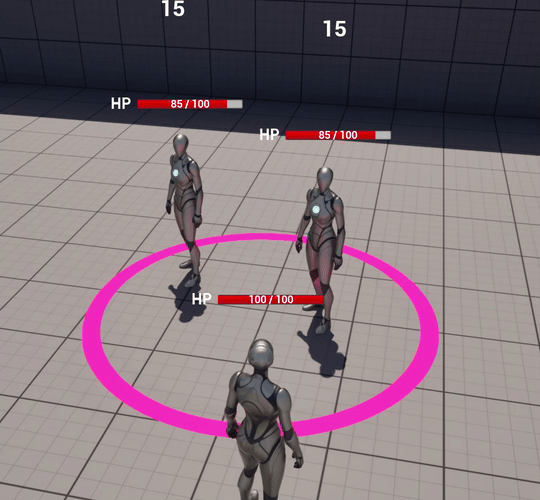

---

## 第 0 步 · 项目设置

建议只在 **UE 代码项目（C++ 项目）**里用 GAS，原因：
- 属性目前**只能在 C++ 里定义**（未来可能放开）；
- 部分功能（如监听属性变化）需要在 C++ 里接线；
- 自定义伤害公式用 C++ 更顺手。

可以用第三人称模板新建项目（务必选 C++ 版本），或在已有项目里做。原文项目名 `AbilitiesLab`，教程按 UE 5.5 编写。

### 0.1 启用 GameplayAbilities 插件

GAS 是 UE 自带的插件。编辑器里 **Edit > Plugins**，勾选 **Gameplay Abilities**，重启编辑器。

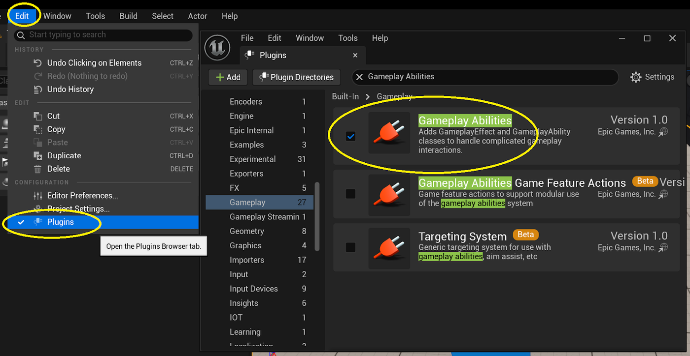

### 0.2 在 Build.cs 里加模块

要写 GAS 的 C++，项目必须链接 GAS 模块。打开项目 `AbilitiesLab.Build.cs`，在 `PublicDependencyModuleNames` 里加入三个模块：

```csharp
public class AbilitiesLab : ModuleRules
{
    public AbilitiesLab(ReadOnlyTargetRules Target) : base(Target)
    {
        PCHUsage = PCHUsageMode.UseExplicitOrSharedPCHs;
        PublicDependencyModuleNames.AddRange(new string[] {
            "Core", "CoreUObject", "Engine", "InputCore",
            // 下面三行是本教程新增
            "GameplayAbilities", "GameplayTags", "GameplayTasks"
        });
    }
}
```

> ⚠️ 如果编译时报 GAS 类的 `unresolved external symbol`（例如 `Z_Construct_UScriptStruct_FGameplayTag`、`FGameplayTagContainer::AddTag` 等链接错误），十有八九就是上面这几个模块没加进 Build.cs。

### 0.3 创建 ASC 子类并挂到角色上

GAS 大部分功能都通过**给 Actor 加一个 Ability System Component (ASC)** 来开启。本教程把它挂到 **Character** 上，因为配置最直观；正式项目应根据 GAS 状态需要活多久来选择位置：

| ASC 放置位置 | 适合场景 | 主要影响 |
|---|---|---|
| **Pawn / Character** | 死亡重生后技能、Buff、冷却和属性都应重置 | Pawn 销毁时 ASC 状态一起销毁，最简单 |
| **PlayerState** | 换 Pawn、死亡重生后仍要保留技能、属性、Buff 或冷却 | 多人游戏最常用；Owner 通常是 PlayerState，Avatar 是当前 Pawn |
| **PlayerController** | 单机中需要跨 Pawn 保留状态、又不想建 PlayerState | 多人游戏不适合作为 ASC 所在 Actor，因为其他客户端没有该 PlayerController |
| **普通 Actor** | 宝箱、可破坏物、载具、建筑等 | 通常 Owner 与 Avatar 都可以设为它自己 |

如果一部分状态要跨重生、一部分不要，通常仍把 ASC 放在持久的 PlayerState 上，再在重生时移除不该保留的效果；这比在两个 ASC 之间迁移状态更可靠。多人 AI 若也需要持久、可复制的 ASC，可以让 AIController 的 `bWantsPlayerState = true`，把 ASC 同样放到 PlayerState；不要把 ASC 放到只存在于服务器的 AIController 上。

同一个 Actor **不要放多个 ASC**。引擎多处默认一个 Actor 最多关联一个 ASC；多个 ASC 会同时发现同一批 AttributeSet，`IAbilitySystemInterface` 也无法明确该返回哪一个。

ASC 建议**用代码加**而不是在蓝图加（代码里访问 ASC 有很多好处，例如监听属性变化）。另外，将来你大概率要往 ASC 里加功能（覆写虚函数或加项目专用辅助函数），所以**提前派生子类**：

```cpp
UCLASS()
class ABILITIESLAB_API ULabAbilitySystemComponent : public UAbilitySystemComponent
{
    GENERATED_BODY()
};
```

然后把组件加进角色类（变量名带上了项目名 `Lab...`）：

```cpp
UCLASS()
class AAbilitiesLabCharacter : public ACharacter
{
    GENERATED_BODY()

public:
    AAbilitiesLabCharacter();

    UPROPERTY(VisibleAnywhere, BlueprintReadOnly, Category = Abilities)
    TObjectPtr<class ULabAbilitySystemComponent> LabAbilitySystemComp;
};

AAbilitiesLabCharacter::AAbilitiesLabCharacter()
{
    ...
    LabAbilitySystemComp = CreateDefaultSubobject<ULabAbilitySystemComponent>(TEXT("AbilitySystem"));
}
```

多人项目还要选择 ASC 的 **Replication Mode**：

| 模式 | 谁能收到完整的 Active Gameplay Effect 信息 | 常见选择 |
|---|---|---|
| **Full** | 所有客户端 | 其他玩家也必须看到效果剩余时间、层数等完整细节时使用，网络开销最大 |
| **Mixed** | ASC 的拥有客户端收到完整信息，其他客户端只收到最小标签信息 | 玩家角色的常用默认选择 |
| **Minimal** | 所有客户端都只收到最小标签信息 | 常用于不需要拥有端查看完整效果详情的 AI；玩家通常不选 |

属性值是否复制不由这个模式决定；属性仍要在 AttributeSet 中用 `ReplicatedUsing` / `DOREPLIFETIME` 单独复制。教程角色可在构造函数设置：

```cpp
LabAbilitySystemComp->SetReplicationMode(EGameplayEffectReplicationMode::Mixed);
```

### 0.4 实现 IAbilitySystemInterface

凡是带 ASC 的 Actor 类，都建议实现 `IAbilitySystemInterface`——主要是**性能**原因（引擎查找 ASC 时走接口是 O(1)，回退到组件搜索是 O(n)）：

```cpp
#include "AbilitySystemInterface.h"

UCLASS(config=Game)
class AAbilitiesLabCharacter : public ACharacter, public IAbilitySystemInterface
{
    ...
    virtual UAbilitySystemComponent* GetAbilitySystemComponent() const override;
};

UAbilitySystemComponent* AAbilitiesLabCharacter::GetAbilitySystemComponent() const
{
    return LabAbilitySystemComp;
}
```

### 0.5 设置 Owner 与 Avatar（InitAbilityActorInfo）

ASC 可以给任何 Actor 用（玩家、Bot、甚至不可摧毁/可摧毁的建筑道具）。它需要知道自己在为谁服务：**Owner（属主）**——长期代表该玩家/Bot/实体的 Actor；**Avatar（替身）**——物理上代表它的 Actor。两者通过调用 `InitAbilityActorInfo(OwnerActor, AvatarActor)` 提供。

本教程把角色同时作为 Owner 与 Avatar，在角色的 `BeginPlay` 里调用：

```cpp
void AAbilitiesLabCharacter::BeginPlay()
{
    Super::BeginPlay();
    // 让 ASC 知道：这个角色既是属主也是替身
    LabAbilitySystemComp->InitAbilityActorInfo(this, this);
    ...
}
```

**为什么必须能找到 PlayerController？** 对玩家而言，`InitAbilityActorInfo` 内部会缓存 PlayerController；本地预测技能、目标选择和输入相关能力都依赖它。Owner 可以是 PlayerController 本身，也可以是能沿 Owner 链找到玩家 Pawn、PlayerState 或 PlayerController 的 Actor。

`InitAbilityActorInfo` 需要在**服务器和客户端分别调用**，并且 Owner 或 Avatar 创建、复制到本机、发生变化时都可以再次调用。常见时机如下：

- ASC 在 Character 上：服务器在 `PossessedBy`，客户端在 `OnRep_Controller` 或确认 Controller 可用后初始化；换控制器时刷新。
- ASC 在 PlayerState 上：服务器在 Pawn 的 `PossessedBy` 初始化；客户端在 Pawn 的 `OnRep_PlayerState` 初始化。此时 Owner 是 PlayerState，Avatar 是当前 Pawn。
- 换 Pawn、上下载具或重生：保留 Owner，把新的 Pawn/载具作为 Avatar 再调用一次。

PlayerState 持有 ASC 的典型写法：

```cpp
void AAbilitiesLabCharacter::PossessedBy(AController* NewController)
{
    Super::PossessedBy(NewController);

    if (AAbilitiesLabPlayerState* PS = GetPlayerState<AAbilitiesLabPlayerState>())
    {
        UAbilitySystemComponent* ASC = PS->GetAbilitySystemComponent();
        ASC->InitAbilityActorInfo(PS, this); // 服务器：Owner=PS，Avatar=Pawn
    }
}

void AAbilitiesLabCharacter::OnRep_PlayerState()
{
    Super::OnRep_PlayerState();

    if (AAbilitiesLabPlayerState* PS = GetPlayerState<AAbilitiesLabPlayerState>())
    {
        UAbilitySystemComponent* ASC = PS->GetAbilitySystemComponent();
        ASC->InitAbilityActorInfo(PS, this); // 客户端独立初始化
    }
}
```

如果 Owner 与 Avatar 早已设置，但客户端稍后才拿到 PlayerController，可调用 `RefreshAbilityActorInfo()`，它会保留现有 Owner/Avatar 并重新解析 PlayerController。可激活本地预测技能前，至少确认：ASC 已有 Owner；需要物理角色的技能已有 Avatar；本地玩家的 PlayerController 已成功缓存；技能已由服务器授予并复制到客户端。

> 💡 **常见坑（社区反馈）**：多人模式里目标技能崩溃在 `GetCurrentActorInfo()->PlayerController` 为空，通常就是客户端初始化太早或控制器后来发生了变化。把初始化放进上述复制/占有回调，并在控制器变更后调用 `RefreshAbilityActorInfo()`。

---

## 第 1 步 · Attribute Set 入门

**Attribute Set（属性集）**是定义一组属性的 C++ 类：生命、伤害、移速这类数值。游戏代码可以直接读这些值、监听变化、或响应阈值（如生命到 0）。把数值管成 GAS 属性的好处：

- 下拉框里直接选属性；
- 属性可以直接用于 GameplayEffect；
- 通过 ASC 监听属性值变化；
- 出现在 GAS 调试工具里；
- 联网项目里：复制、预测、回滚都方便。

> 属性集**只能在 C++ 里创建**（蓝图目前无法定义属性）。

### 1.1 定义 Health 与 MaxHealth

创建 `UAttributeSet` 的子类，用 `FGameplayAttributeData` 类型加 `UPROPERTY()` 定义属性。先定义两个：`Health`、`MaxHealth`：

```cpp
UCLASS()
class ABILITIESLAB_API ULabHealthAttributeSet : public UAttributeSet
{
    GENERATED_BODY()

public:
    // 当前生命值
    UPROPERTY(VisibleAnywhere, BlueprintReadOnly, ReplicatedUsing=OnRep_Health)
    FGameplayAttributeData Health;

    // 生命上限
    UPROPERTY(VisibleAnywhere, BlueprintReadOnly, ReplicatedUsing=OnRep_MaxHealth)
    FGameplayAttributeData MaxHealth;

    UFUNCTION()
    void OnRep_Health(const FGameplayAttributeData& OldHealth);

    UFUNCTION()
    void OnRep_MaxHealth(const FGameplayAttributeData& OldMaxHealth);

    virtual void GetLifetimeReplicatedProps(
        TArray<FLifetimeProperty>& OutLifetimeProps) const override;
};
```

**联网项目**：属性复制要使用 `ReplicatedUsing`、`DOREPLIFETIME_CONDITION_NOTIFY` 和 `GAMEPLAYATTRIBUTE_REPNOTIFY` 的完整组合。`REPNOTIFY_Always` 让服务器值即使恰好等于客户端预测值，也仍通知 GAS 更新聚合器、预测状态和属性变化委托。**单机项目可跳过复制相关**：

```cpp
#include "Net/UnrealNetwork.h"

void ULabHealthAttributeSet::GetLifetimeReplicatedProps(TArray<FLifetimeProperty>& OutLifetimeProps) const
{
    Super::GetLifetimeReplicatedProps(OutLifetimeProps);
    DOREPLIFETIME_CONDITION_NOTIFY(
        ULabHealthAttributeSet, Health, COND_None, REPNOTIFY_Always);
    DOREPLIFETIME_CONDITION_NOTIFY(
        ULabHealthAttributeSet, MaxHealth, COND_None, REPNOTIFY_Always);
}

void ULabHealthAttributeSet::OnRep_Health(
    const FGameplayAttributeData& OldHealth)
{
    GAMEPLAYATTRIBUTE_REPNOTIFY(
        ULabHealthAttributeSet, Health, OldHealth);
}

void ULabHealthAttributeSet::OnRep_MaxHealth(
    const FGameplayAttributeData& OldMaxHealth)
{
    GAMEPLAYATTRIBUTE_REPNOTIFY(
        ULabHealthAttributeSet, MaxHealth, OldMaxHealth);
}
```

启动编辑器后，引擎会自动扫描属性集类并缓存其属性。之后凡是可以编辑 `FGameplayAttribute` 的地方（例如建 GE 时），都能在下拉框里选中 `LabHealthAttributeSet.Health`。

### 1.2 属性访问器（ACCESSORS）与初始值

`AttributeSet.h` 源码里有个很方便的宏 `ATTRIBUTE_ACCESSORS`，复制到你的属性集头文件顶部，它会给每个属性生成 `GetHealth` / `SetHealth` / `InitHealth` 等函数，外加用于比较的 `GetHealthAttribute()`：

```cpp
#define ATTRIBUTE_ACCESSORS(ClassName, PropertyName) \
    GAMEPLAYATTRIBUTE_PROPERTY_GETTER(ClassName, PropertyName) \
    GAMEPLAYATTRIBUTE_VALUE_GETTER(PropertyName) \
    GAMEPLAYATTRIBUTE_VALUE_SETTER(PropertyName) \
    GAMEPLAYATTRIBUTE_VALUE_INITTER(PropertyName)
```

> 从 **UE 5.6** 起不必再复制这个宏，引擎直接提供 `ATTRIBUTE_ACCESSORS_BASIC`。

在类声明里对每个属性用一次宏：

```cpp
UCLASS()
class ABILITIESLAB_API ULabHealthAttributeSet : public UAttributeSet
{
    GENERATED_BODY()
    ...
    ATTRIBUTE_ACCESSORS(ULabHealthAttributeSet, Health);
    ATTRIBUTE_ACCESSORS(ULabHealthAttributeSet, MaxHealth);
};
```

宏会生成 `InitMyAttribute()` 函数，在构造函数里初始化数值：

```cpp
ULabHealthAttributeSet::ULabHealthAttributeSet()
{
    InitHealth(100.0f);
    InitMaxHealth(100.0f);
}
```

属性初始值不只有一种来源。按项目规模选择即可：

| 方案 | 何时使用 | 注意事项 |
|---|---|---|
| 构造函数里的 `InitHealth(100)` | 教程、固定规则、编译期常量 | 最简单，但设计师不能在蓝图里逐个角色调值 |
| Character 的 `PostInitializeComponents` / `BeginPlay` | 初始值来自角色蓝图变量 | 此时可以读取蓝图默认值；只让服务器写权威属性，客户端等复制 |
| **初始 Gameplay Effect** | 大多数正式项目 | 最推荐：数值可在 GE/曲线表中配置，还能按角色等级传入 Level |
| `AttributeSetInitter` + Curve Table | 大量属性、职业和等级成长表 | 适合统一数据表驱动；表的行名和分组必须遵守初始化器约定 |
| ASC 的 `DefaultStartingData` | 想直接在 ASC 蓝图配置起始属性 | 必须提供 **AttributeMetaData DataTable**；不要把普通 Curve Table 填进去 |

本教程继续用构造函数即可。若要让设计师配置，建议创建一个 Instant GE，例如 `GE_Initial_PlayerAttributes`，给 Health、MaxHealth 等属性配置 **Override** 或 **Add** modifier，并在服务器初始化 ASC 后施加一次：

```cpp
void AAbilitiesLabCharacter::ApplyInitialAttributes()
{
    if (!HasAuthority() || !InitialAttributesEffect || !LabAbilitySystemComp)
    {
        return;
    }

    FGameplayEffectContextHandle Context = LabAbilitySystemComp->MakeEffectContext();
    Context.AddSourceObject(this);

    const float CharacterLevel = 1.0f;
    FGameplayEffectSpecHandle Spec = LabAbilitySystemComp->MakeOutgoingSpec(
        InitialAttributesEffect, CharacterLevel, Context);

    if (Spec.IsValid())
    {
        LabAbilitySystemComp->ApplyGameplayEffectSpecToSelf(*Spec.Data.Get());
    }
}
```

把该函数放在 `InitAbilityActorInfo` 成功之后调用，并用一个服务器端布尔值或初始化状态防止重生/重复 Possess 时再次叠加。若初始 GE 使用 Override，仍应避免无意义地重复施加，以免覆盖已经变化的生命值。

到目前为止你的属性集头文件大致长这样（供对照）：

```cpp
#pragma once
#include "CoreMinimal.h"
#include "AttributeSet.h"
#include "AbilitySystemComponent.h"
#include "LabHealthAttributeSet.generated.h"

#define ATTRIBUTE_ACCESSORS(ClassName, PropertyName) \
    GAMEPLAYATTRIBUTE_PROPERTY_GETTER(ClassName, PropertyName) \
    GAMEPLAYATTRIBUTE_VALUE_GETTER(PropertyName) \
    GAMEPLAYATTRIBUTE_VALUE_SETTER(PropertyName) \
    GAMEPLAYATTRIBUTE_VALUE_INITTER(PropertyName)
```

### 1.3 把 Attribute Set 挂到角色

属性集可以加到任何带 ASC 的 Actor 上。如果你确定所有角色都要生命属性，最好在 C++ 里直接加。ASC 会自动找到并使用所有属性集子对象：

```cpp
// 角色头文件里
UPROPERTY(VisibleAnywhere, BlueprintReadOnly, Category = Abilities)
TObjectPtr<class ULabHealthAttributeSet> HealthSet;

// 构造函数里
HealthSet = CreateDefaultSubobject<ULabHealthAttributeSet>(TEXT("HealthSet"));
```

这种 `CreateDefaultSubobject` 创建的是 Actor 的默认子对象（DSO），生命周期与角色一致，是固定属性集最稳妥的方式。之后可用 `LabAbilitySystemComp->GetSet<ULabHealthAttributeSet>()` 取回已经注册的集合；`GetSet` **只查找，不负责创建**。

若属性集由装备、变身或临时形态决定，也可以在运行时让 ASC 创建并注册：

```cpp
ULabHealthAttributeSet* RuntimeHealthSet =
    LabAbilitySystemComp->AddSet<ULabHealthAttributeSet>();
```

运行时增删属性集应由服务器决定。移除之前必须先清掉所有会读取或修改该集合的持续 GE、技能和监听器；否则稍后到达的属性复制或仍在运行的效果可能访问一个已不存在的集合。多数角色属性并不需要动态集合：固定集合优先用 DSO，动态装备数值通常也可以保留在固定集合里，再通过 GE 增减。

### 1.4 用 Gameplay Debugger 验证

此时角色应该有：一个 ASC + 一个初始 `Health = 100 / MaxHealth = 100` 的属性集。

运行 PIE（Play In Editor，可单机可联网）。游戏里按 **Shift + `** 打开 Gameplay Debugger 并瞄准自己；用小键盘数字键关掉默认的 AI 分类、打开 **Abilities** 分类，应该能看到 Health / MaxHealth = 100。

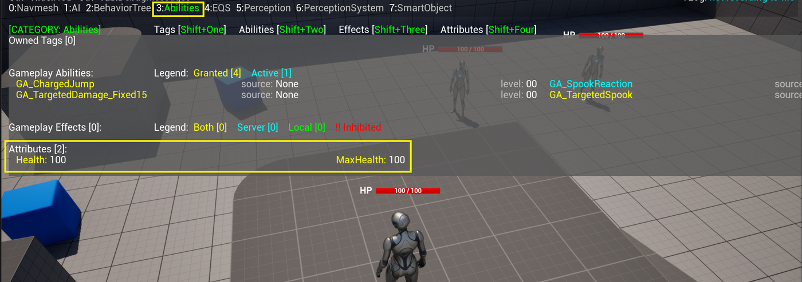

除了 Gameplay Debugger，GAS 自带的控制台命令已经足够完成本教程的排错。先在 PIE 中按 `~` 打开控制台；网络 PIE 若要操作服务器，先执行 `EnableCheats`，再给支持的命令加 `-Server`：

| 命令 | 用途 |
|---|---|
| `ShowDebug AbilitySystem` | 在 HUD 上查看当前目标的属性、标签、已授予技能和 Active GE |
| `AbilitySystem.DebugBasicHUD` | 开关简化 GAS 调试 HUD |
| `AbilitySystem.DebugAttribute Health` | 聚焦显示名称含 Health 的属性；不带参数可清除过滤 |
| `AbilitySystem.DebugAbilityTags` | 显示与技能激活有关的标签信息 |
| `AbilitySystem.Ability.ListGranted` | 列出 ASC 已获授的技能与状态 |
| `AbilitySystem.Ability.Grant GA_DamageSelf` | 临时给当前目标授予技能；联网可加 `-Server` |
| `AbilitySystem.Ability.Activate GA_DamageSelf` | 按名称激活技能；联网可加 `-Server` |
| `AbilitySystem.Ability.Cancel GA_DamageSelf` | 取消正在运行的技能；联网可加 `-Server` |
| `AbilitySystem.Effect.ListActive` | 列出当前 Active GE、层数与剩余时间 |
| `AbilitySystem.Effect.Apply GE_DamageImmune` | 临时施加 GE；联网可加 `-Server` |
| `AbilitySystem.Effect.Remove GE_DamageImmune` | 移除匹配的 GE；联网可加 `-Server` |

三种界面各有侧重：

- **Gameplay Debugger**（Shift + `）：适合边瞄准角色边比较服务端/客户端的属性、技能、标签与效果；默认可用小键盘 **3** 切到 Abilities 分类。
- **ShowDebug AbilitySystem**：适合快速查看自己或当前调试目标的 ASC 状态。
- **Visual Logger**：适合追查“刚才为什么没激活”。开始录制后重现问题，时间线上能同时看到技能、GE、属性和激活失败原因。

如果命令找不到蓝图资产，输入完整生成类名（例如 `GA_DamageSelf_C`）或先用 `ListGranted` / `ListActive` 确认引擎实际识别到的名称。

---

## 第 2 步 · Gameplay Effect 入门

**Gameplay Effect (GE)** 是对 Actor 的属性/标签施加状态变化的主要机制。GE 有**来源（source）**与**目标（target）**——自己对自己施加时两者相同。GE 还能配置在目标身上跑自定义逻辑、或授予目标技能。

### 2.1 持续时间策略（Duration Policy）

GE 可以是**瞬时**的（立即且永久改属性），也可以**限时**的（只在生效期间改属性/授标签）。在 GE 蓝图的 **Duration Policy** 里选择，不同选项会出现不同的配套设置：

| 策略 | 含义 |
|---|---|
| **Instant（瞬时）** | 「发射后不管」：不进入 ASC 的状态列表，直接执行。Modifier 对属性的改动是**永久**的 |
| **Duration（限时）** | 预先知道生效时长（固定值如 3 秒，或运行时计算），到期自动移除 |
| **Infinite（无限）** | 同 Duration，但时长不确定——直到游戏代码显式移除才结束 |

非瞬时 GE 一旦被移除，它对属性和标签的修改会**全部还原**。GE 施加的标签能影响其他 GE/GA 的行为（下文演示）。

限时 GE 还能配 **Period（周期）**：生效期间每隔一个周期就重复执行一次 modifier/execution，可做「每秒掉血」「每秒回血」「热量积累」这类效果。注意：**配了周期的 GE，其 modifier 是永久的**（周期结束不再移除），标签则仍只覆盖整个时长。

> 一句话总结：**Instant = 永久改动；Duration = 可逆改动；Periodic = 反复执行的 Instant + 全程生效的标签**。

### 2.2 创建第一个 Instant GE：GE_Health_Minus15

创建一个基于 `GameplayEffect` 类的蓝图，命名 `GE_Health_Minus15`，用来对自己造成伤害：

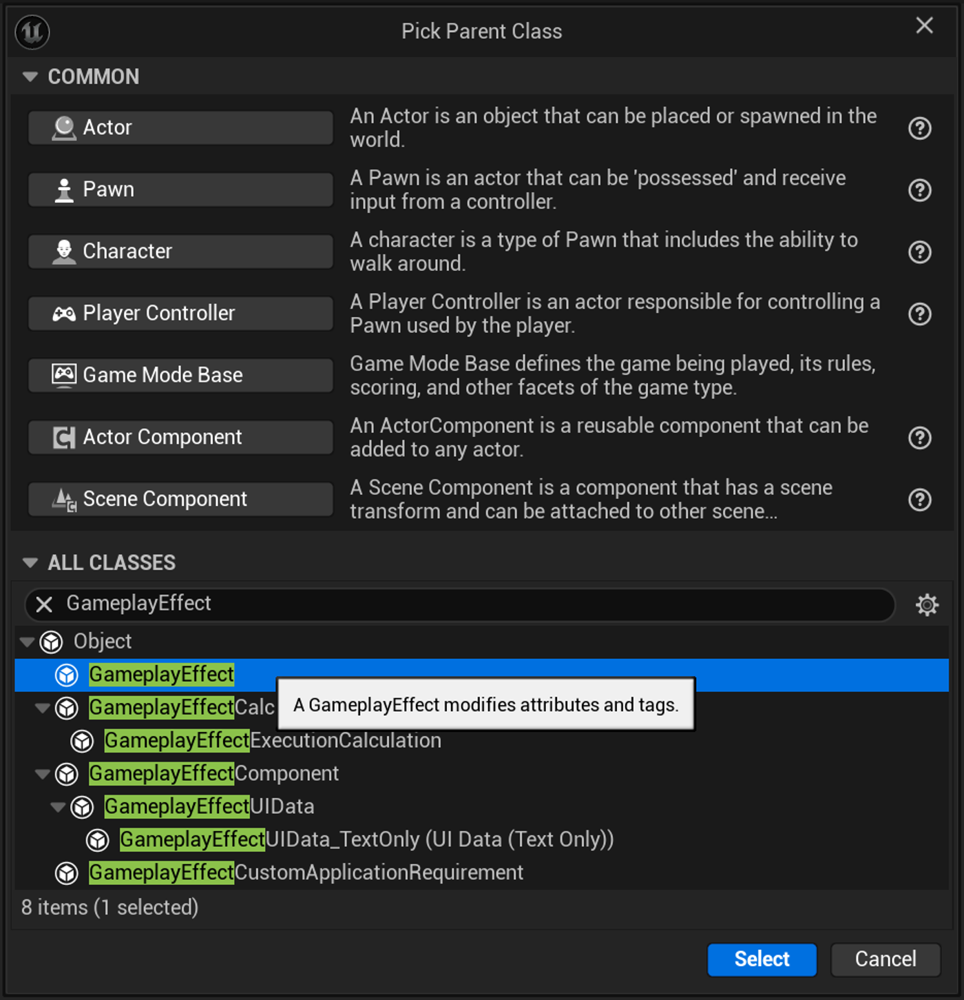

1. Duration Policy 保持默认 **Instant**（发射后不管、永久扣血）；
2. 在 **Modifiers** 数组加一项：Attribute 选 `LabHealthAttributeSet.Health`；
3. Modifier Op 保持默认 **Add (Base)**；
4. Magnitude 用 **Scalable Float**，值填 **-15.0**。

这样该 GE 一经施加，就立即、永久地从 Health 扣 15。

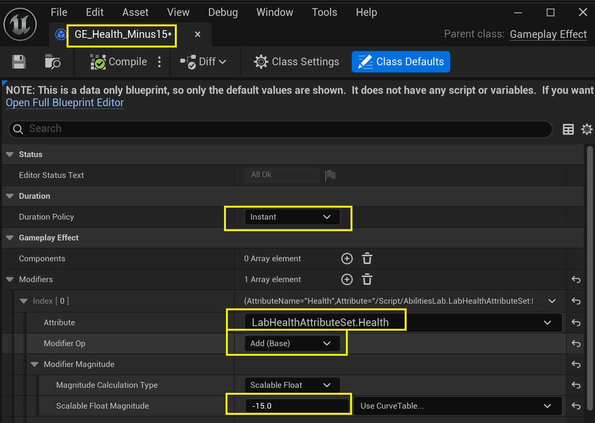

### 2.3 用调试键 X 施加 GE

在角色蓝图里加一个调试键 **X**，调用 ASC 的 `ApplyGameplayEffectToSelf`，选刚建的 GE 类。进游戏按 X，打开 GameplayDebugger（` 键）就能看到 Health 每次 -15。

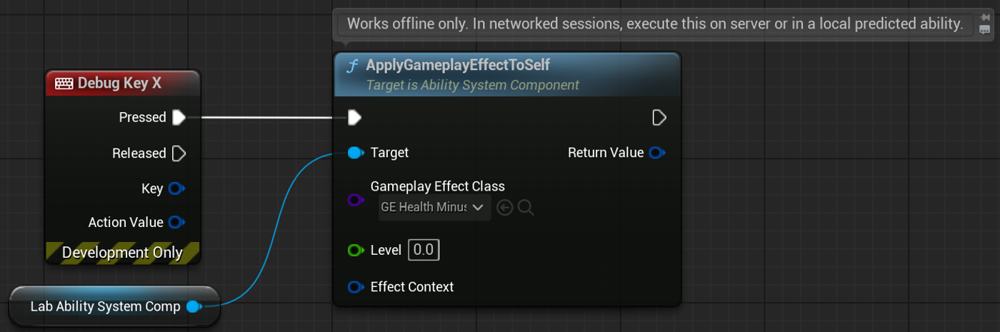

**联网时注意**：多人会话里 GE 必须满足以下之一才能生效——
- **在服务器上施加**（例如玩家输入触发一个 Server RPC，在服务器上施加 GE）；
- 由 **Local Predicted 技能**施加（下文会做技能，默认就是 Local Predicted：客户端预测性施加 + 请求服务器执行同样逻辑）；
- 在有效的**本地预测窗口**内施加。

预测窗口可以理解为“这批客户端操作共用的一张临时收据”。ASC 为窗口生成 `PredictionKey`；窗口内预测施加的 GE 会记住这把 key。服务器接受时，客户端预测结果与权威结果合并；服务器拒绝时，GAS 用同一把 key 删除预测结果。Local Predicted 技能在激活时会建立窗口，所以技能开头直接施加 GE 通常不需要手工处理。离开技能、经过某些等待节点，或在普通 Actor 代码里直接施加时，当前 key 可能已失效，此时客户端调用不会成为可回滚的预测操作。

因此本教程采用两条简单规则：**伤害只让服务器施加；需要即时手感的自身消耗、冷却和表现放进 Local Predicted 技能，并尽早在 `CommitAbility` 附近执行。**只有编写自定义 Ability Task 或确实需要在异步回调后继续预测时，才在 C++ 中显式建立新的 `FScopedPredictionWindow`，并让对应的服务端 RPC 携带该 prediction key。

如果你正在多人项目里跟着做，先做一个**在服务器执行的服务器事件**再调用施加（原文截图里就是加了一个 `Server` 事件调用 ApplyGameplayEffectToSelf）。

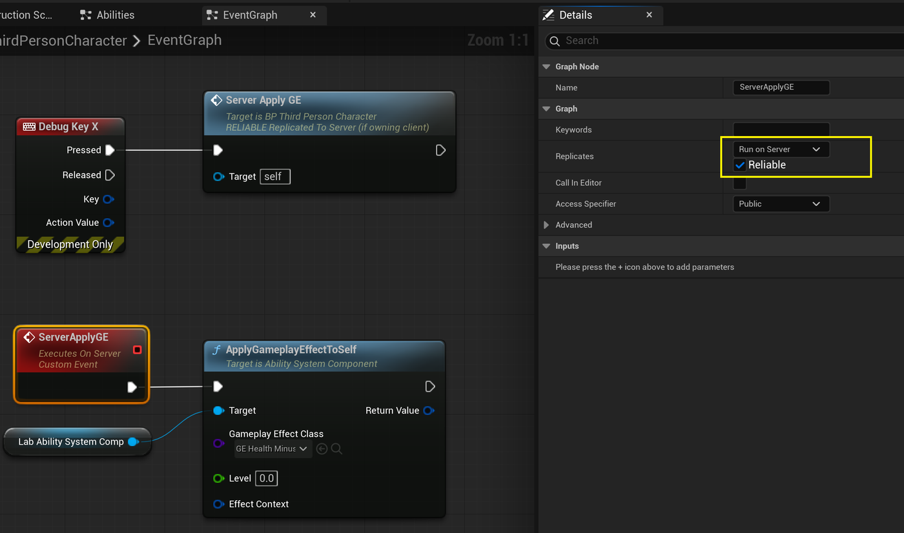

### 2.4 运行时数值的几种来源

固定写死「-15」有时不够，伤害常常要在运行时查表或计算。GAS 提供多种方式：

1. **Scalable Float（可缩放浮点）**：随「等级」缩放。等级可以来自天赋树、难度设置或敌人等级，施加 GE 时传入，配合可选的曲线表按等级乘以数值。
2. **自定义计算类（Custom Calculation Class）**：GE 的 modifier 可以指定一个类，自己写幅值怎么算/怎么取——例如从 Actor 属性、函数、当前移速、是否蹲伏/格挡/冲刺来取值。
3. **SetByCaller 幅值**：创建 GE Spec 后，由施加者用 GameplayTag 写入一个运行时浮点数；GE 的 modifier、Duration 或 Execution 再按同一标签读取。典型场景：命中速度决定击退力度、武器本次命中决定伤害。
4. **Meta Attribute（元属性）与 Execution**：当公式比 modifier 复杂（要算暴击、格挡、分类型抗性）时，引入只负责传递中间结果的元属性，并在 **GameplayEffectExecutionCalculation** 类里于服务器端完成计算（配在 GE 的 Executions 属性上）。

下文会演示 Meta Attribute 的用法。

**SetByCaller 可直接照做的例子**：先创建 GameplayTag `Data.Damage`。在 `GE_Damage_Runtime` 中新增对 `Damage` 的 Add modifier，把 Magnitude 类型改为 **Set By Caller**、Data Tag 设为 `Data.Damage`。施加时不要直接应用 GE 类，而是先创建 Spec 并填值：

```cpp
const FGameplayTag DamageTag = FGameplayTag::RequestGameplayTag(TEXT("Data.Damage"));
FGameplayEffectContextHandle Context = SourceASC->MakeEffectContext();
Context.AddSourceObject(WeaponOrAbility);

FGameplayEffectSpecHandle Spec = SourceASC->MakeOutgoingSpec(
    DamageEffectClass, AbilityLevel, Context);

if (Spec.IsValid())
{
    Spec.Data->SetSetByCallerMagnitude(DamageTag, 37.5f);
    SourceASC->ApplyGameplayEffectSpecToTarget(*Spec.Data.Get(), TargetASC);
}
```

标签必须与 GE 里配置的 Data Tag 完全一致；漏填时通常会得到警告并采用默认值，伤害可能变成 0。SetByCaller 存在于**本次 Spec** 上，所以同一个 GE 类可以为每次命中携带不同数值，而不用动态创建 GE 类。

---

## 第 3 步 · 与属性交互

### 3.1 把 Health 钳制在 [0, MaxHealth]

按 X 次数多了 Health 会变负。让数值始终落在 (0, MaxHealth) 区间——回到属性集 C++，覆写 `PreAttributeChange`。它拿到的是「将要变成的值」，允许你在它对外生效前改掉它：

```cpp
UCLASS()
class ABILITIESLAB_API ULabHealthAttributeSet : public UAttributeSet
{
    ...
    virtual void PreAttributeChange(const FGameplayAttribute& Attribute, float& NewValue) override;
};

void ULabHealthAttributeSet::PreAttributeChange(const FGameplayAttribute& Attribute, float& NewValue)
{
    UE_LOG(LogTemp, Warning, TEXT("PreChange: Attribute '%s'"), *Attribute.AttributeName);
    if (Attribute == GetHealthAttribute())
    {
        NewValue = FMath::Clamp(NewValue, 0.0f, GetMaxHealth());
    }
    Super::PreAttributeChange(Attribute, NewValue);
}
```

> `PreAttributeChange` 会为本属性集**每一个属性**调用，所以每次都拿 `GetHealthAttribute()` 判断这次改的是不是 Health；`GetMaxHealth()` / `GetHealthAttribute()` 都是访问器宏生成的。

编译运行后再狂按 X：Health 永远不会低于 0；做一个加血的 GE，也不会超过 MaxHealth。

`PreAttributeChange` 只钳制“这次正在修改的属性”。当 MaxHealth 从 100 降到 60 时，旧 Health=90 不会自动再次经过 Health 的 `PreAttributeChange`，所以还要在上限变化后主动处理。最直接的规则是“保留当前生命，但不能超过新上限”：

```cpp
void ULabHealthAttributeSet::PostAttributeChange(
    const FGameplayAttribute& Attribute,
    float OldValue,
    float NewValue)
{
    Super::PostAttributeChange(Attribute, OldValue, NewValue);

    if (Attribute == GetMaxHealthAttribute() && GetHealth() > NewValue)
    {
        if (UAbilitySystemComponent* ASC = GetOwningAbilitySystemComponent())
        {
            ASC->ApplyModToAttribute(
                GetHealthAttribute(),
                EGameplayModOp::Override,
                FMath::Max(0.0f, NewValue));
        }
    }
}
```

如果设计规则是“保持生命百分比”，则在 MaxHealth 变化时计算 `OldHealth * NewMax / OldMax` 再写回 Health。两种策略选一种统一使用；不要只依赖钳制，否则临时加上限的 Buff 移除后可能留下 `Health > MaxHealth`。

> 💡 **常见坑（社区反馈）**：某些引擎版本（如 UE 5.7.2）里 `Attribute == GetHealthAttribute()` 的比较可能不生效，改用比较 `Attribute.AttributeName == GetHealthAttribute().AttributeName` 可绕过（见文末「常见坑」）。

### 3.2 响应属性变化（为血条做准备）

接下来做头顶血条（自己和其他角色都能看到）。UMG 属性值本就可通过 ASC/属性集在蓝图读，但**不要每帧刷新**，只在变化时响应。为此在属性集里加一个蓝图可绑定的委托 `OnHealthChanged`。

**单机**：在属性集里覆写 `PostAttributeChange` 就能捕获所有本地变化。
**联网**：值也可能走网络复制（服务器改了、客户端收到新值），而 `PostAttributeChange` **只在本地调用**——服务器施加 GE 时客户端不会执行它。客户端要靠复制回调（`ReplicatedUsing` 的 `OnRep_*`）来处理。下面演示；单机项目可省略 `ReplicatedUsing` 与 OnRep 函数。

```cpp
DECLARE_DYNAMIC_MULTICAST_DELEGATE_ThreeParams(FAttributeChangedEvent, UAttributeSet*, AttributeSet, float, OldValue, float, NewValue);

UCLASS()
class ABILITIESLAB_API ULabHealthAttributeSet : public UAttributeSet
{
    ...
    // 当前生命值（带复制回调）
    UPROPERTY(VisibleAnywhere, BlueprintReadOnly, ReplicatedUsing=OnRep_Health)
    FGameplayAttributeData Health;

    // 生命值变化事件（蓝图可绑定）
    UPROPERTY(BlueprintAssignable)
    FAttributeChangedEvent OnHealthChanged;
    ...
    UFUNCTION()
    void OnRep_Health(const FGameplayAttributeData& OldHealth);

    UFUNCTION()
    void OnRep_MaxHealth(const FGameplayAttributeData& OldMaxHealth);
};

void ULabHealthAttributeSet::PostAttributeChange(const FGameplayAttribute& Attribute, float OldValue, float NewValue)
{
    Super::PostAttributeChange(Attribute, OldValue, NewValue);
    UE_LOG(LogTemp, Warning, TEXT("PostChange: Attribute '%s' changed %.2f -> %.2f"), *Attribute.AttributeName, OldValue, NewValue);

    if (Attribute == GetHealthAttribute())
    {
        OnHealthChanged.Broadcast(this, OldValue, NewValue);
    }
    else if (Attribute == GetMaxHealthAttribute())
    {
        OnHealthChanged.Broadcast(this, OldValue, NewValue);
    }
}

void ULabHealthAttributeSet::OnRep_Health(
    const FGameplayAttributeData& OldHealth)
{
    GAMEPLAYATTRIBUTE_REPNOTIFY(
        ULabHealthAttributeSet, Health, OldHealth);
    OnHealthChanged.Broadcast(
        this, OldHealth.GetCurrentValue(), GetHealth());
}

void ULabHealthAttributeSet::OnRep_MaxHealth(
    const FGameplayAttributeData& OldMaxHealth)
{
    GAMEPLAYATTRIBUTE_REPNOTIFY(
        ULabHealthAttributeSet, MaxHealth, OldMaxHealth);
    OnHealthChanged.Broadcast(
        this, OldMaxHealth.GetCurrentValue(), GetMaxHealth());
}
```

这里不能只广播自定义委托而漏掉 `GAMEPLAYATTRIBUTE_REPNOTIFY`；后者负责让 GAS 正确协调客户端预测值和内部聚合器。上面的 `OnHealthChanged` 只是额外通知 Widget 刷新。

> 3.1 已经实现过 `PostAttributeChange`；实际项目里把本节的广播分支合并进同一个函数，不要再定义第二个同名函数。

**备选：在 C++ 里通过 ASC 监听**——用 ASC 的委托，但会把逻辑绑死在 ASC/所属 Actor 类上、耦合度高，适合「某个 Actor 特有」的行为：

```cpp
FOnGameplayAttributeValueChange& AttributeDelegate =
    LabAbilitySystemComp->GetGameplayAttributeValueChangeDelegate(ULabHealthAttributeSet::GetHealthAttribute());
AttributeDelegate.AddLambda([](const FOnAttributeChangeData& Data)
{
    UE_LOG(LogTemp, Warning, TEXT("Health changed: %.2f -> %.2f"), Data.OldValue, Data.NewValue);
});
```

> ⚠️ **联网粒度提醒**：服务器连续改多次属性时，客户端通过复制**通常只收到最终值**——`OnRep_Health` 不会收到每一次变化，所以 `OnHealthChanged` 粒度不够处理每一次伤害事件。逐条处理伤害事件要用 Gameplay Cue（下文演示）。

### 3.3 创建血条 Widget

1. 新建 **Widget Blueprint**（基类默认 UserWidget），命名 `WBP_HealthBarWorld`。

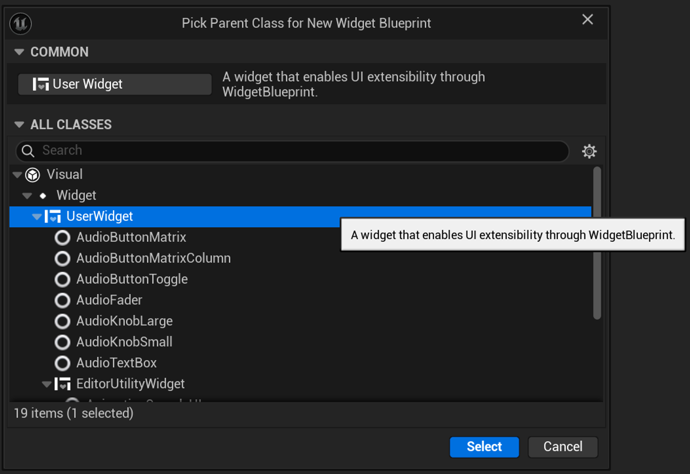

2. 用一个 **Overlay** 作为根容器：底层放 **ProgressBar**，建议大小约 `160 × 16`；上层放 **TextBlock**，水平/垂直居中，显示 `{Health} / {MaxHealth}`。ProgressBar 的 Percent 使用 `MaxHealth > 0 ? Health / MaxHealth : 0`，再 Clamp 到 `[0, 1]`；文本可按需要取整。具体美术尺寸可以改，不影响后续绑定逻辑。

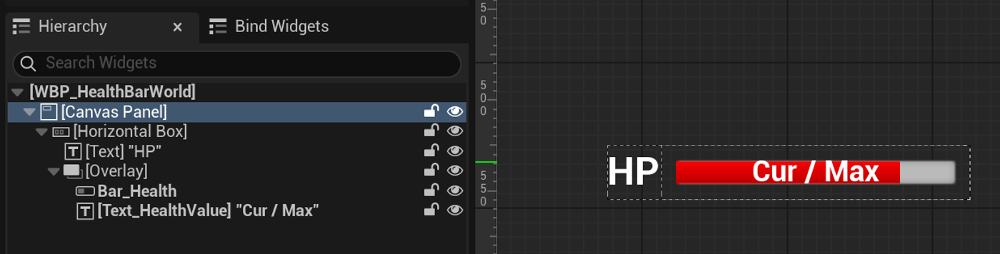

3. 在 Widget 的 Event Graph 建自定义事件 `SetHealthAttributeSet`（参数：属性集引用），存进变量 `TargetHealthSet`。
4. 建函数 `RefreshHealth`——之后用它刷新显示：初始立刻刷新一次，此后只在 Health/MaxHealth 变化时调用。做法：把 `RefreshHealth` 绑到属性集的 `OnHealthChanged` 委托上；`SetHealthAttributeSet` 被调用时先解绑旧的 HealthSet 再绑新的（保证 Widget 可复用）。

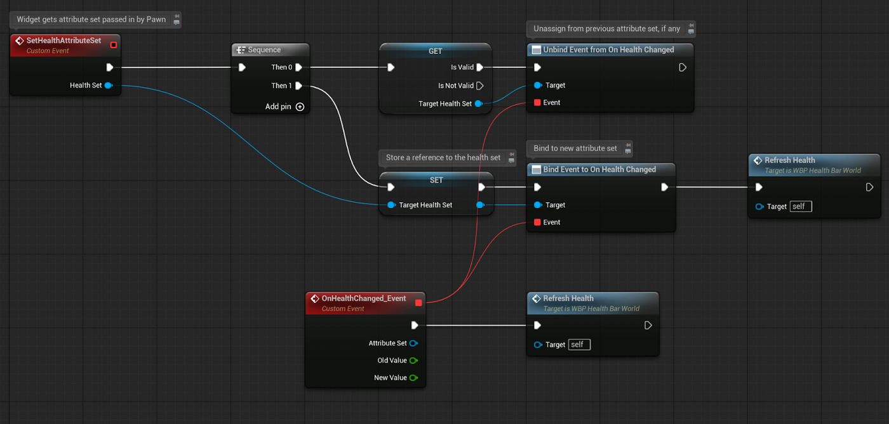

5. `RefreshHealth` 图里：读当前 Health / MaxHealth，更新 ProgressBar 的 Percent 与 TextBlock 的文本。

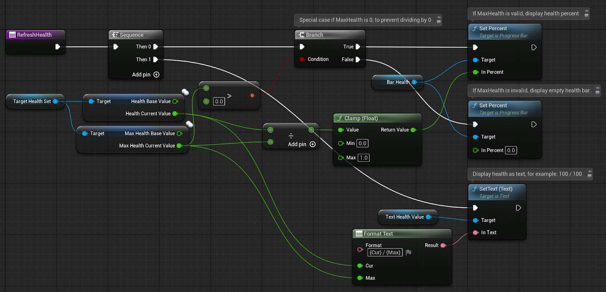

然后回到角色蓝图：
6. 给角色加 **Widget Component**，摆到合适位置（头顶上方），Widget Class 选 `WBP_HealthBarWorld`，渲染模式用 **Screen Space**。

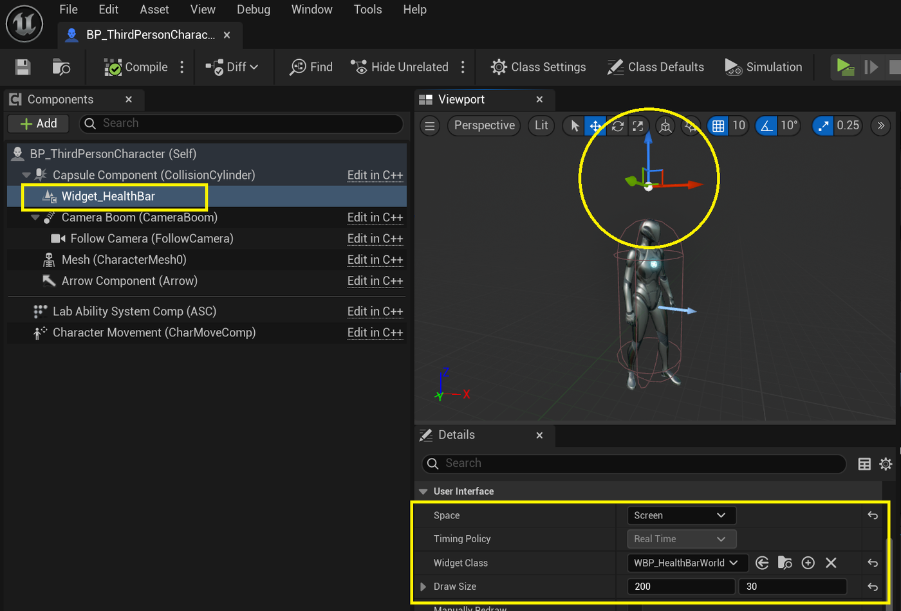

7. 在 `BeginPlay` 里，用 ASC 的「获取任意属性集」函数（`GetSet`/`GetAttributeSet` 之类）拿到角色的 `LabHealthAttributeSet`，调用 Widget 的 `SetHealthAttributeSet` 传进去。

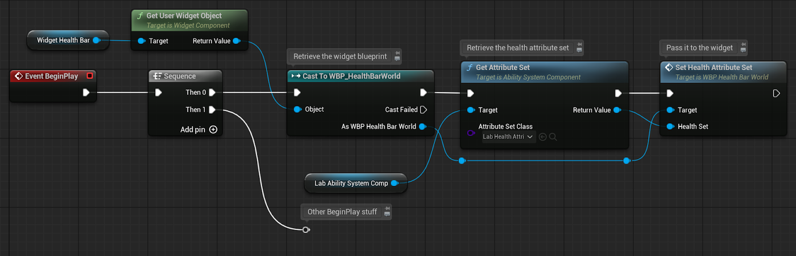

再进游戏：所有角色头上都有血条，且随生命变化实时刷新。

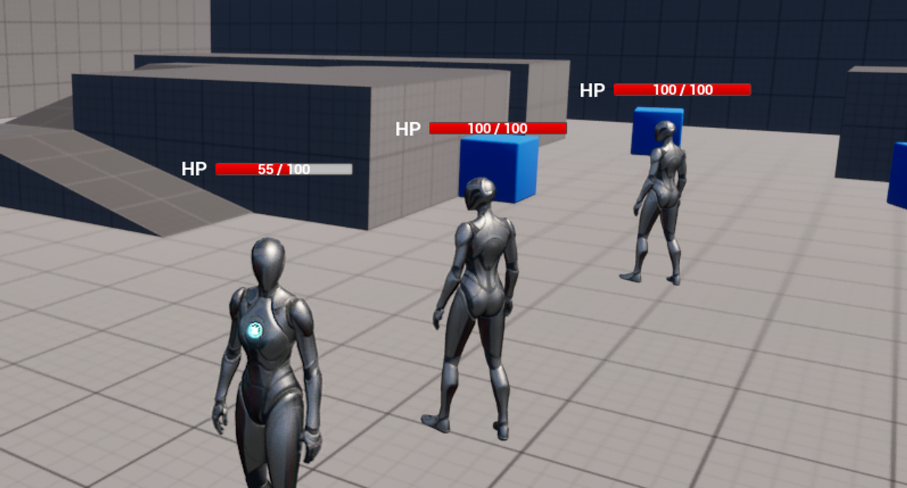

### 3.4 Damage 元属性（把伤害计算与扣血解耦）

上面是「GE 直接改 Health」。真实游戏里伤害往往取决于攻方/守方一堆属性与倍率，还可能有点击吸收伤害的护盾机制。很多公式用自定义代码比配置 GE modifier 更方便——做法是：**在 GE 的 Execution 里算伤害，存进元属性 `Damage`，由属性集消费**（Lyra 示例工程与堡垒之夜都是这么做的）。

这给了程序员两个介入点：**GE 的 Execution**（能拿到事件细节）算伤害；**属性集类**实现不依赖事件细节的机制（护盾吸收等）。

在 Health 属性集里加 `Damage` 元属性并覆写 `PostGameplayEffectExecute`：

```cpp
UCLASS()
class ABILITIESLAB_API ULabHealthAttributeSet : public UAttributeSet
{
    ...
    virtual void PostGameplayEffectExecute(const struct FGameplayEffectModCallbackData& Data) override;

    // GE 结算出的伤害值。元属性。
    UPROPERTY(VisibleAnywhere)
    FGameplayAttributeData Damage;
    ATTRIBUTE_ACCESSORS(ULabHealthAttributeSet, Damage);
};

void ULabHealthAttributeSet::PostGameplayEffectExecute(const FGameplayEffectModCallbackData& Data)
{
    Super::PostGameplayEffectExecute(Data);
    if (Data.EvaluatedData.Attribute == GetDamageAttribute())
    {
        // 换算成 -Health，然后钳制
        const float DamageValue = GetDamage();
        const float OldHealthValue = GetHealth();
        const float MaxHealthValue = GetMaxHealth();
        const float NewHealthValue = FMath::Clamp(OldHealthValue - DamageValue, 0.0f, MaxHealthValue);
        SetHealth(NewHealthValue);
        SetDamage(0.0f); // 元属性只承载这一次结算结果
    }
}
```

> 如果游戏有「护盾先于生命承受伤害」机制，`PostGameplayEffectExecute` 就是实现它的好地方。

**禁止直接改 Health**：给 Health 属性加 `meta = (HideFromModifiers)`，它就会从 GE 的 Modifiers 下拉框里消失（其它地方仍可选）：

```cpp
UPROPERTY(VisibleAnywhere, BlueprintReadOnly, ReplicatedUsing=OnRep_Health, meta = (HideFromModifiers))
FGameplayAttributeData Health;
```

改一下之前用的 `GE_Health_Minus15` 来测试新流程：把「Health -15」改成「Damage **+15**」。施加后游戏里仍应扣 15 血——注意 Health 现在在 GE 的 Modifiers 里已经选不到了。

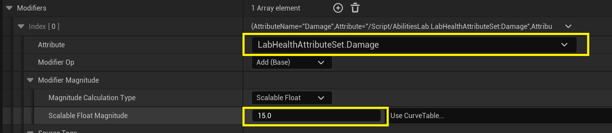

### 3.5 什么是 Execution（执行计算）

GE 可以配置 **Executions**：施加 GE 时执行的自定义逻辑类。它们强大是因为能拿到 GE 施加时的**全部细节**，包括：
- GE 配置的 modifiers 与标签；
- 施放者（instigator）的 ASC；
- 目标的 ASC；
- 游戏代码施加效果时提供的运行时值与标签。

自定义 Execution 类继承 `UGameplayEffectExecutionCalculation`。下面把上一节的 Damage 元属性扩成一个最小的“运行时火焰伤害 × 火焰抗性”流程。

先在 `ULabHealthAttributeSet` 增加 `FireResistance` 属性与访问器，约定范围为 0–100：

```cpp
UPROPERTY(VisibleAnywhere, BlueprintReadOnly, ReplicatedUsing=OnRep_FireResistance)
FGameplayAttributeData FireResistance;
ATTRIBUTE_ACCESSORS(ULabHealthAttributeSet, FireResistance);
```

然后创建 `ULabDamageExecution`。它捕获目标抗性，从本次 GE Spec 的 `Data.Damage.Fire` SetByCaller 值读取原始伤害，最后把结算结果写入 Damage 元属性：

```cpp
// LabDamageExecution.h
#pragma once
#include "GameplayEffectExecutionCalculation.h"
#include "LabDamageExecution.generated.h"

UCLASS()
class ABILITIESLAB_API ULabDamageExecution
    : public UGameplayEffectExecutionCalculation
{
    GENERATED_BODY()

public:
    ULabDamageExecution();

    virtual void Execute_Implementation(
        const FGameplayEffectCustomExecutionParameters& ExecutionParams,
        FGameplayEffectCustomExecutionOutput& OutExecutionOutput) const override;
};
```

```cpp
// LabDamageExecution.cpp
#include "LabDamageExecution.h"
#include "LabHealthAttributeSet.h"
#include "AbilitySystemComponent.h"

namespace LabDamage
{
    struct FCaptures
    {
        DECLARE_ATTRIBUTE_CAPTUREDEF(FireResistance);

        FCaptures()
        {
            // Snapshot=false：执行当下读取目标最新抗性
            DEFINE_ATTRIBUTE_CAPTUREDEF(
                ULabHealthAttributeSet, FireResistance, Target, false);
        }
    };

    const FCaptures& Captures()
    {
        static FCaptures Value;
        return Value;
    }
}

ULabDamageExecution::ULabDamageExecution()
{
    RelevantAttributesToCapture.Add(
        LabDamage::Captures().FireResistanceDef);
}

void ULabDamageExecution::Execute_Implementation(
    const FGameplayEffectCustomExecutionParameters& Params,
    FGameplayEffectCustomExecutionOutput& Out) const
{
    const FGameplayEffectSpec& Spec = Params.GetOwningSpec();
    const FGameplayTag FireDamageTag =
        FGameplayTag::RequestGameplayTag(TEXT("Data.Damage.Fire"));

    const float RawDamage = Spec.GetSetByCallerMagnitude(
        FireDamageTag, false, 0.0f);

    FAggregatorEvaluateParameters EvalParams;
    EvalParams.SourceTags = Spec.CapturedSourceTags.GetAggregatedTags();
    EvalParams.TargetTags = Spec.CapturedTargetTags.GetAggregatedTags();

    float FireResistance = 0.0f;
    Params.AttemptCalculateCapturedAttributeMagnitude(
        LabDamage::Captures().FireResistanceDef,
        EvalParams,
        FireResistance);

    const float Resistance01 =
        FMath::Clamp(FireResistance / 100.0f, 0.0f, 1.0f);
    const float FinalDamage = FMath::Max(0.0f, RawDamage * (1.0f - Resistance01));

    Out.AddOutputModifier(FGameplayModifierEvaluatedData(
        ULabHealthAttributeSet::GetDamageAttribute(),
        EGameplayModOp::Additive,
        FinalDamage));
}
```

最后创建一个 Instant GE `GE_FireDamage`：不需要普通 modifier，在 **Executions** 数组加入 `LabDamageExecution`。施加前按 2.4 节的方式制作 Spec，只是把标签换成 `Data.Damage.Fire`。目标的 `PostGameplayEffectExecute` 随后会把 Damage 转成 Health 扣减并清零。以后要支持冰霜/物理伤害，可以增加相应 SetByCaller 标签和抗性捕获，或用资产标签选择公式；核心原则是：**Execution 负责算，Damage 元属性负责把结果交给 AttributeSet，AttributeSet 负责护盾、生命、死亡等最终规则。**

> **联网**：配了 Executions 的 GE 施加时，Executions **只在服务器上执行**——因为客户端预测性施加的任意逻辑无法在服务器拒绝时自动回滚。

---

## 第 4 步 · Gameplay Ability 入门

前面都是直接施加 GE。用 **Gameplay Ability (GA)** 来做这件事能白拿一堆好处。GA 通过带能力专用节点的蓝图事件图实现跨帧行为（比如播动画 → 等播完 → 生成弹丸）。技能可以在运行时被授予/收回，模块化地给 Actor 加功能，并且**默认自带网络预测**。跨帧行为（目标选择、等动画、等玩家输入）靠 **Ability Task（能力任务）**：只存在于 GameplayAbility 蓝图里的「延迟节点」（输出执行引脚晚点才触发）。

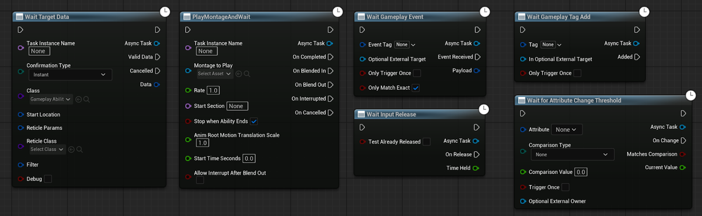

在 GAS 项目里，技能蓝图通常负责：
- 施加消耗与冷却；
- 让玩家做目标选择；
- 播动画并利用其时机。

**联网时「自带预测」意味着**：
- 客户端触发服务器技能无需新增 RPC；
- 客户端可以先本地施加 GE（改属性/标签），等服务器接受或拒绝——这对输入手感至关重要；
- 客户端与服务器执行同一张蓝图图，并互相等待对方到达同一节点。

### 4.1 创建第一个技能 GA_DamageSelf

1. 新建蓝图，父类 **GameplayAbility**，命名 `GA_DamageSelf`。

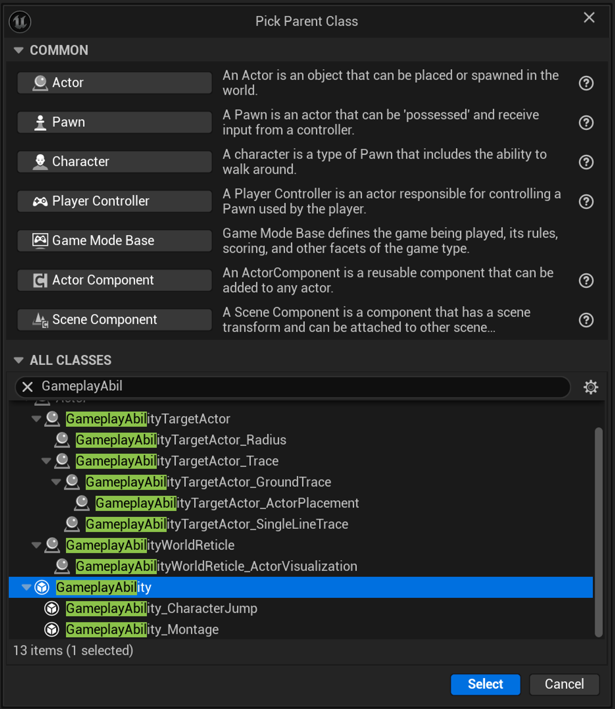

2. 打开蓝图：在 **Event ActivateAbility** 上调用 `ApplyGameplayEffectToOwner`，提供 `GE_Health_Minus15`，然后调用 **End Ability**——**技能会保持激活直到你显式结束它**。

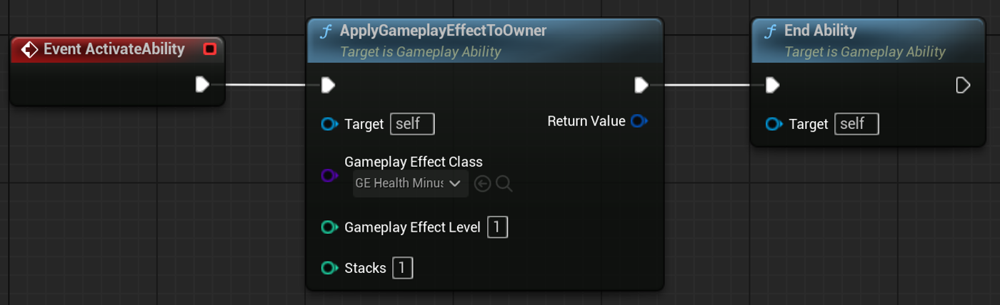

3. 回到角色蓝图：
   - 在 `BeginPlay` 调用 ASC 的 `GiveAbility` 授予技能（**联网时只有服务器能授予技能**）；
   - 把调试键 X 的事件改为调用 ASC 的 `TryActivateAbilityByClass` 激活技能。

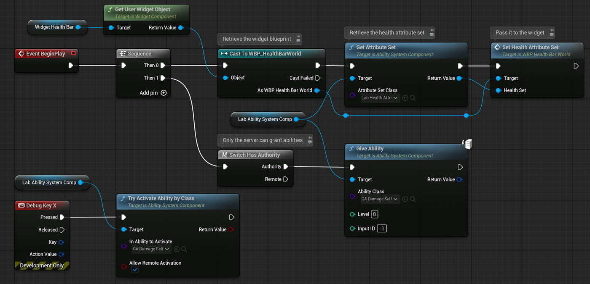

进游戏按 X：成功激活时血会下降。

### 4.2 联网技能与预测效果

多人测试时你会发现：**客户端调 `TryActivateAbilityByClass` 不用额外写 Server RPC**（对比直接在客户端施加 GE）。客户端调用 ASC 的任意 `TryActivateAbility` 系列函数时，只要技能配置允许，就会通知服务器，同时**本地也执行**、按配置**预测性施加 GE**。这由技能的 **Net Execution Policy（网络执行策略）** 与 **Net Security Policy** 控制。预测 = 抢在服务器之前执行游戏逻辑，代价是服务器最终可能不认可。

默认策略 **Local Predicted（本地预测）**：客户端立即执行技能蓝图并发请求让服务器也执行；客户端可先施加受 GAS 预测系统支持的 GE，服务器随后执行权威版本并复制结果。若服务器拒绝，GAS 会按 PredictionKey 协调或移除预测副作用。不要把 Execution、Meta Attribute 结算或任意瞬时伤害当成可安全回滚的客户端结果；本教程的伤害仍只由服务器决定。

**伤害类游戏一般不预测**——预测错了体验很糟（血量跳动、死亡动画被打断）。把技能 Net Execution Policy 设为 **Server Only**，技能就只在服务器执行（客户端仍可激活，前提是 Net Security Policy 允许）。此时由于延迟，你会看到血量**略慢一拍**才下降——游戏常用预测性地播放音效/粒子来掩盖这段延迟，并接受「服务器拒绝时这些表现是错的」。

### 4.3 冷却与消耗

GA 的**冷却（Cooldown）与消耗（Cost）**都由 GE 表达，分别填进能力蓝图的 **Cooldown Gameplay Effect Class** 和 **Cost Gameplay Effect Class**。下面给 `GA_DamageSelf` 加一套可验证的配置。

**1. 添加 Energy 属性**

按 Health 的完整写法给属性集增加 `Energy` / `MaxEnergy`、访问器与复制回调，初始都设为 100，并在 `PreAttributeChange` 中把 Energy 钳制到 `[0, MaxEnergy]`。

**2. 创建消耗 GE**

新建 `GE_Cost_Energy20`：

- Duration Policy：**Instant**；
- Modifier Attribute：`Energy`；
- Modifier Op：**Add**；
- Magnitude：`-20`。

把它填到 `GA_DamageSelf` 的 **Cost Gameplay Effect Class**。GAS 在尝试激活时会先检查该 Cost GE 的属性 modifier 是否会让资源低于 0；Energy 不够时，能力根本不会进入激活逻辑。能力激活后资源仍可能被别的系统抢先扣掉，所以 Commit 时还会再检查一次。

**3. 创建冷却 GE**

在 Gameplay Tag Manager 创建 `Cooldown.DamageSelf`，再新建 `GE_Cooldown_DamageSelf`：

- Duration Policy：**Duration**；
- Duration Magnitude：`3.0` 秒；
- 添加 **Grant Tags to Target Actor** 组件，授予 `Cooldown.DamageSelf`。

把它填到 `GA_DamageSelf` 的 **Cooldown Gameplay Effect Class**。冷却 GE 必须是 Duration 或 Infinite，并授予至少一个用于识别冷却的 GameplayTag；只要拥有者身上仍存在这个 GE/标签，能力就无法再次激活。UI 需要倒计时时，可在能力中调用 `GetCooldownTimeRemaining`，或在 ASC 上按 `Cooldown.DamageSelf` 查询 Active GE 的剩余时间与总时长。

**4. 正确 Commit 并处理失败**

在能力蓝图开头调用 **`CommitAbility`**，按布尔返回值分支：

```text
Event ActivateAbility
  → CommitAbility
      True  → 施加伤害 → EndAbility
      False → EndAbility（Was Cancelled = true）
```

Commit 成功才会实际施加 Cost 和 Cooldown；失败分支不能继续生成弹丸、造成伤害或播放不可撤销的逻辑。**任何配置了 Cost/Cooldown 的技能如果不调用 Commit，就等于绕过了它们。**

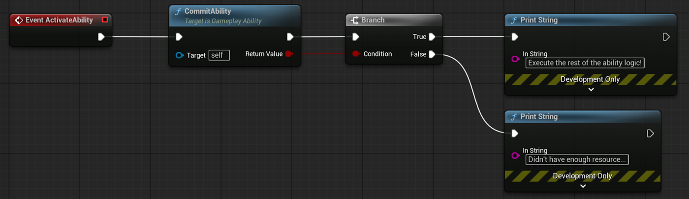

Commit 的位置也是玩法设计的一部分：按下就付费的技能在开头 Commit；目标技能通常在 `WaitTargetData` 成功、玩家确认目标后 Commit；取消瞄准则不付费；蓄力技能通常在松开并确认释放时 Commit。Local Predicted 技能在有效预测窗口中 Commit 时，客户端可先显示扣能量与冷却，服务器拒绝后由 GAS 协调预测结果。

验证方法：连续成功触发 5 次后 Energy 应为 0，第 6 次不能激活；每次成功触发后的 3 秒内也不能再次激活。用 `AbilitySystem.Effect.ListActive` 可以看到冷却 GE 与剩余时间。

### 4.4 必需/阻挡标签（Required & Blocking Tags）

GameplayTag 在 GAS 里被大量用于 GE 与 GE、GA 与 GA 之间的互动。标签可以在项目设置的 **Gameplay Tag Manager** 里建，也可以在任何标签细节面板里直接创建。

GE 和 GA 都可以「要求某些标签才可施加/激活」，或「有某些标签就被阻挡」。另外，GE 还能「照常施加，但只有满足条件才真正生效」——条件不满足时 GE 休眠，modifier 与标签都不上 ASC。下面给 GA 和 GE 各演示一种阻挡。

**GE 的应用阻挡**：打开 `GE_Health_Minus15`，加一个 **Require Tags to Apply/Continue This Effect** 组件（UE 5.3 起部分 GE 设置被挪进了可选组件），在 **Must Not Have Tags** 下新建标签 `Damage.Conditions.Immune`。含义：目标带 `Damage.Conditions.Immune` 标签时该 GE 无法施加。

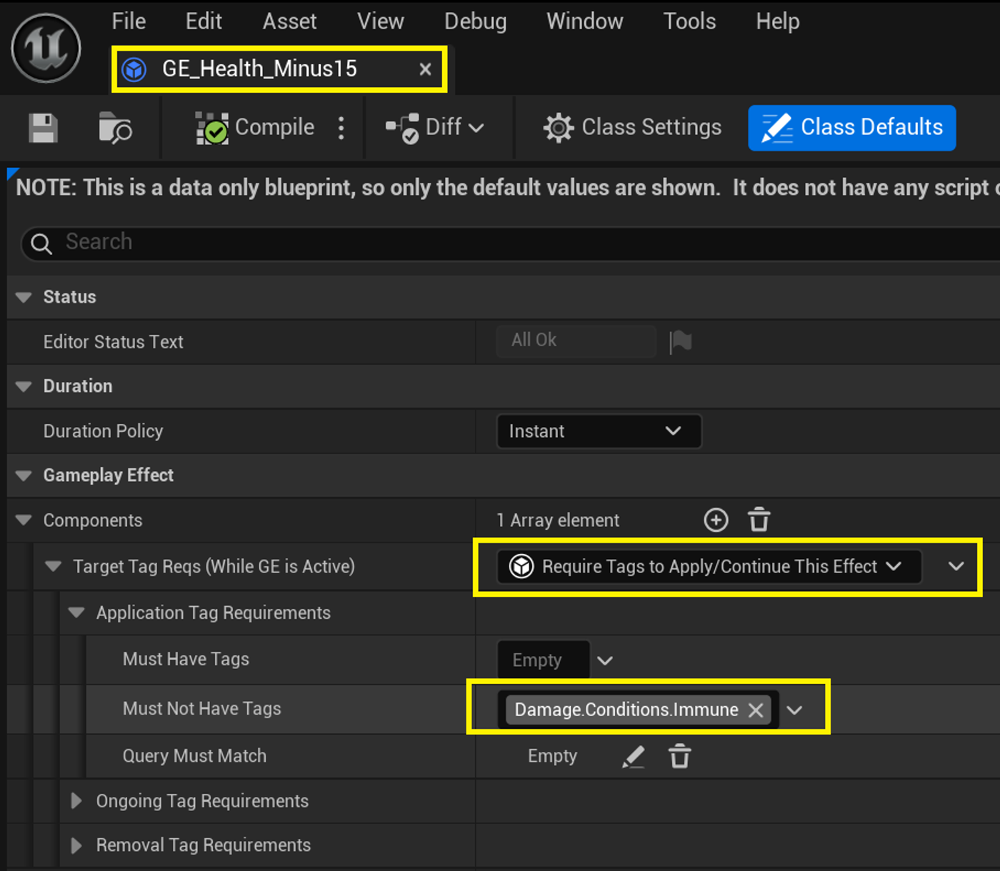

再做一个授予该标签的 GE：新建 `GE_DamageImmune`，加 **Grant Tags to Target Actor** 组件，加 `Damage.Conditions.Immune` 标签，Duration Policy 设为 **Infinite**（施加后一直生效，直到游戏代码移除）。

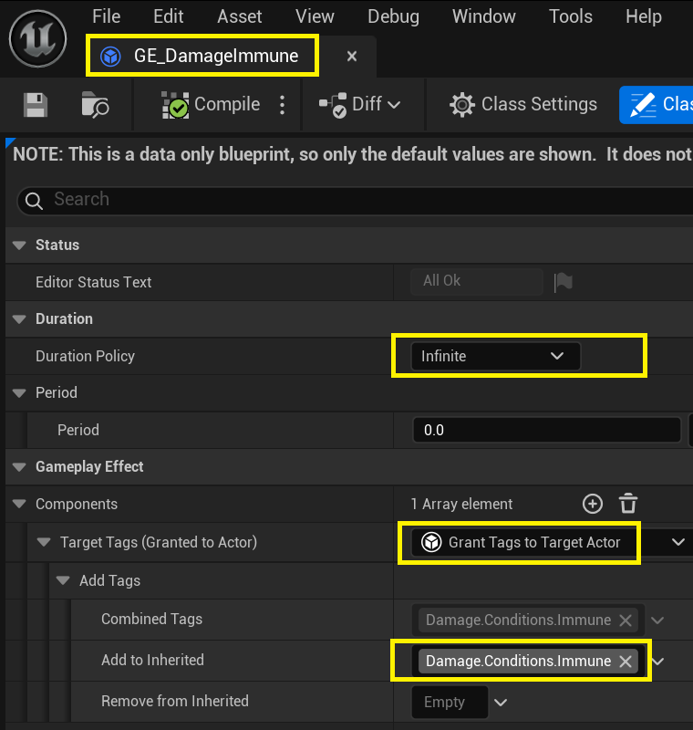

**立刻在游戏里验证**（使用 1.4 节已经列出的调试命令）：

- 单机会话，控制台（~）执行：`AbilitySystem.Effect.Apply GE_DamageImmune`
- 网络会话，执行：`EnableCheats` 后 `AbilitySystem.Effect.Apply -Server GE_DamageImmune`

打开 GameplayDebugger（Shift + `）确认角色身上有 `Damage.Conditions.Immune` 标签，然后按调试键 X 激活 `GA_DamageSelf`（会尝试对自己施加 `GE_Health_Minus15`）：一切正常的话**血不会掉**，Output Log 里能看到 GE 被挡的日志——把 `LogGameplayEffects` 设为 Verbose 级别查看：

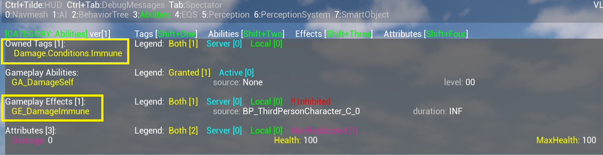

```
LogGameplayEffects: Verbose: Default__GE_Health_Minus15_C could not apply. Blocked by TargetTagRequirementsGameplayEffectComponent_0
```

**GA 的激活阻挡**同理：眩晕、沉默、比赛结束等状态都可以做成 ASC 上的标签。GA 相关的字段是 **Activation Required Tags（激活必需标签）**与 **Activation Blocked Tags（激活阻挡标签）**。

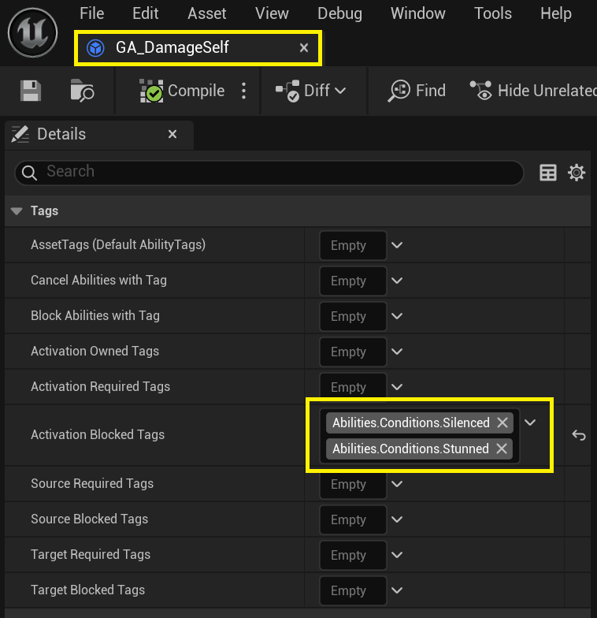

> ✍️ **练习**：自己实现一个 `Stunned` 或 `Silenced` 标签，让带该标签的角色无法激活技能。

### 4.5 激活、结束与取消技能

技能可以通过多种入口启动：ASC 的 `TryActivateAbilityByClass`、按 Spec Handle、按 GameplayTag、InputID，或者 Gameplay Event / Ability Trigger。它们都只是“尝试激活”，最终仍会统一检查冷却、消耗、标签和 `CanActivateAbility` 等条件；联网客户端调用这些入口时，GAS 会按 Net Execution Policy 把请求路由到服务器。

能力一旦进入 Active 状态，就必须明确收尾：

- **EndAbility**：正常完成。会结束仍在运行的 Ability Tasks，并释放该能力占用的状态；它**不会自动 Commit**。
- **CancelAbility**，或 `EndAbility` 时标记 **Was Cancelled**：失败、玩家取消、被眩晕打断等非正常结束。取消同样会清理任务，并触发与取消有关的回调。
- 若能力不允许被取消，先检查其取消设置；不要让外部系统假定每个技能都能强制中止。

漏掉 End/Cancel 会让技能一直保持激活，常见后果是下一次无法启动、阻挡标签不释放、Ability Task 和委托继续存活。

---

## 第 5 步 · 目标技能（Targeted Abilities）

> **先说结论**：本节演示的 InputID 与 Targeting Actor 方案适合快速上手，但**现阶段较死板、不适合大型项目**。Lyra 用的是更可扩展的方案（技能通过数据资产「Input Config」绑输入、用 GameplayTag 触发，源自堡垒之夜的思路）；堡垒之夜的目标选择用的则是 TargetingSystem 插件而非 GAS 的 targeting actor。

**Targeting Actor（目标选择 Actor）**：技能蓝图可以生成一个 targeting actor 并等它工作——让玩家瞄准并显示准星。通过 **WaitTargetData** 能力任务完成。GAS 自带几种 targeting actor 类，各自参数不同（在 WaitTargetData 节点里选时显示）；不够用可以自己写。

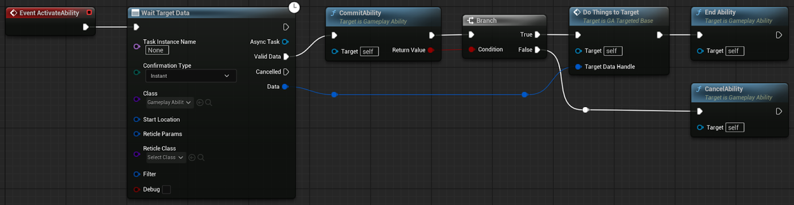

本教程做两个目标技能，所以先把目标选择逻辑抽成**父类技能**。

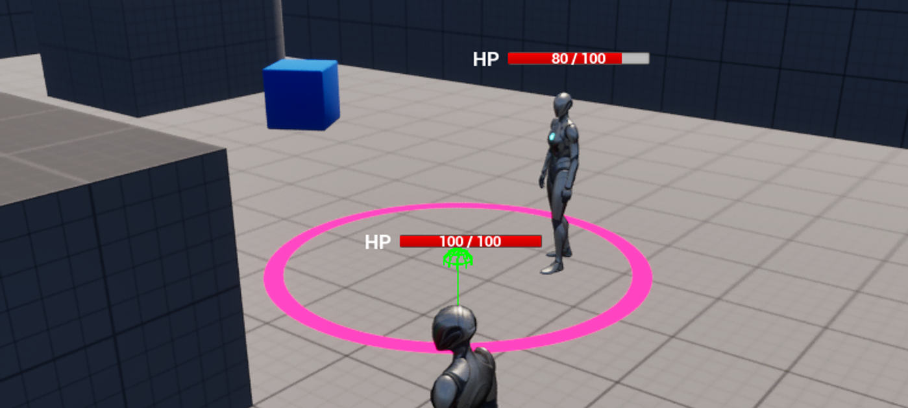

### 5.1 用 InputID 绑定技能激活

本教程用 **InputID** 同时完成技能激活和 Targeting Actor 的确认/取消。完整链路是：输入 Action 映射到枚举值；服务器授予技能时把该值写进 `FGameplayAbilitySpec::InputID`；ASC 绑定 InputComponent 后，按键时查找同 InputID 的技能并尝试激活。冷却、消耗和标签检查仍照常执行。

**1. 定义输入动作**：项目输入设置里——
- 两个动作 `ConfirmTargeting` / `CancelTargeting`（准星显示时确认/取消目标选择）；
- 若干与技能槽对应的动作（像 MOBA/街机游戏那样 2~4 个技能槽）。

本教程把鼠标左右键绑到确认/取消，Q/E/R 绑技能槽（WASD 留给移动）。

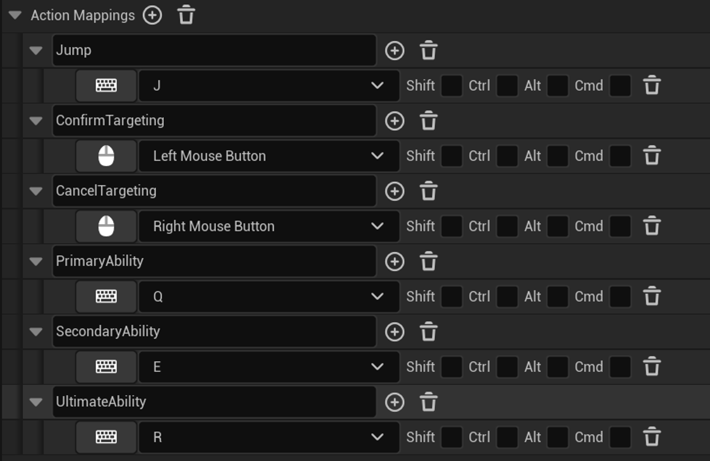

**2. 建技能槽枚举**：代码里建蓝图可见的枚举，条目名字与技能槽动作一致：

```cpp
UENUM(BlueprintType)
enum class EMyAbilitySlotsEnum : uint8
{
    PrimaryAbility,     // Q
    SecondaryAbility,   // E
    UltimateAbility     // R
};
```

**3. 绑定输入动作到枚举**：角色类里把 InputComponent 与 ASC 接起来，告诉 ASC 哪些输入动作触发技能、哪些确认/取消目标选择。在 `SetupPlayerInputComponent` 里调 ASC 的 `BindAbilityActivationToInputComponent`：

```cpp
void AAbilitiesLabCharacter::SetupPlayerInputComponent(UInputComponent* PlayerInputComponent)
{
    const FTopLevelAssetPath EnumName("/Script/AbilitiesLab.EMyAbilitySlotsEnum");
    FGameplayAbilityInputBinds Binds("ConfirmTargeting", "CancelTargeting", EnumName);
    LabAbilitySystemComp->BindAbilityActivationToInputComponent(PlayerInputComponent, Binds);
}
```

**4. 授技能时带上 InputID**：GiveAbility 时给一个枚举值作为 InputID——之后按下同名输入动作对应的键就会触发该技能。例如给 `GA_DamageSelf` 配 InputID，进游戏按 Q 就能触发。C++ 的等价写法如下，仍然只能由服务器授予：

```cpp
if (HasAuthority())
{
    FGameplayAbilitySpec Spec(
        DamageSelfAbilityClass,
        /*AbilityLevel=*/1,
        static_cast<int32>(EMyAbilitySlotsEnum::PrimaryAbility));
    LabAbilitySystemComp->GiveAbility(Spec);
}
```

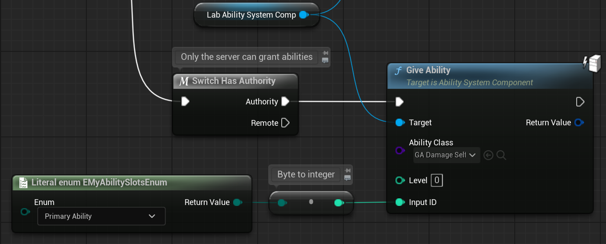

InputID 还决定输入类 Ability Task 监听哪个按键：

- `WaitInputRelease`：等待玩家第一次松开**激活本技能的键**，并返回按住时长；适合蓄力。
- `WaitInputPress`：能力已激活后，等待玩家再次按下该技能键。
- `WaitForConfirm` / `WaitForCancel`：监听 `FGameplayAbilityInputBinds` 中指定的全局 Confirm/Cancel 动作，常用于准星确认和取消。

这些任务都要求 ASC 已完成 ActorInfo 初始化、技能已带正确 InputID 授予、输入组件也已经绑定。能力结束或取消时，仍在运行的输入任务会一起清理。大型项目常用 Enhanced Input + GameplayTag 的项目级映射替代固定枚举，但其核心仍是把按下/松开状态转发给 ASC；本教程的 InputID 方案足以完成后续练习。

### 5.2 创建目标技能基类 GA_TargetingBase

1. 新建 GameplayAbility 蓝图 `GA_TargetingBase`。
2. 加 **WaitTargetData** 节点，Targeting Class 选 `GameplayAbilityTargetActor_LineTrace`，按截图配置：
   - **Class**：被生成的目标选择类。`SingleLineTrace` 从屏幕中央做一次线追踪，若拾取点距 StartLocation 不超过 MaxRange 就接受。
   - **MaxRange**：距 StartLocation 允许的最大范围。
   - **StartLocation**：判断目标是否在范围内的参考点（**不是线追踪的起点**，通常是角色位置）。
   - **Debug**：打开调试线渲染（还没做准星视觉时很有用）。
3. 节点后调用 **EndAbility**——**复用 WaitTargetData 前必须先结束技能**。

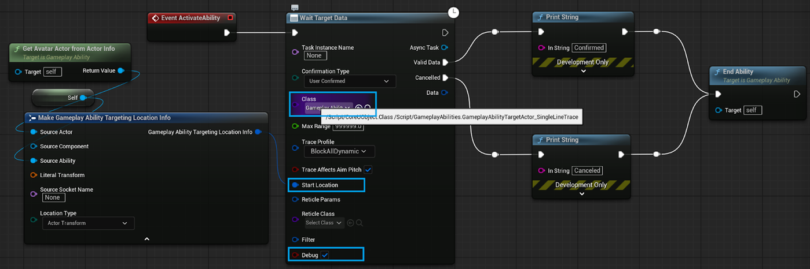

激活技能后，LineTrace targeting actor 会生成并按调试渲染。

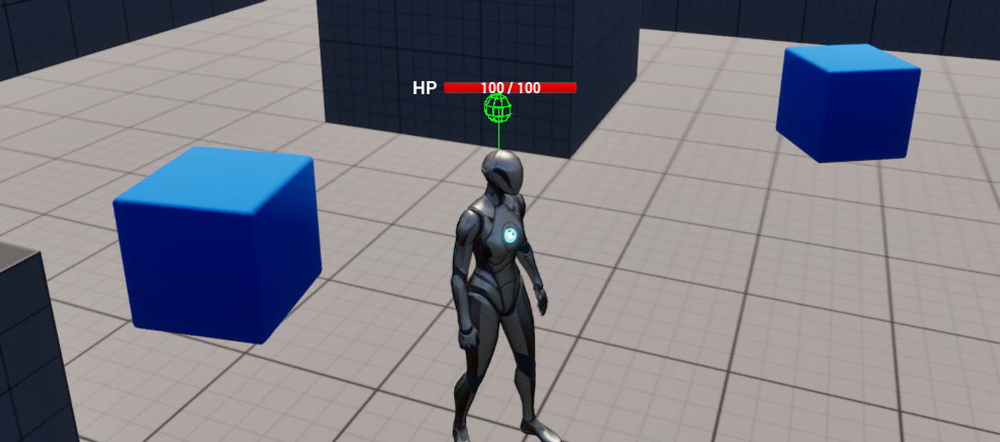

### 5.3 做瞄准圈 GAR_Area_200

把调试线换成瞄准圈：
1. 建 Actor 蓝图 `GAR_Area_200`：一个无碰撞的 Plane 静态网格 + 一个渲染「遮罩圆环」的材质。

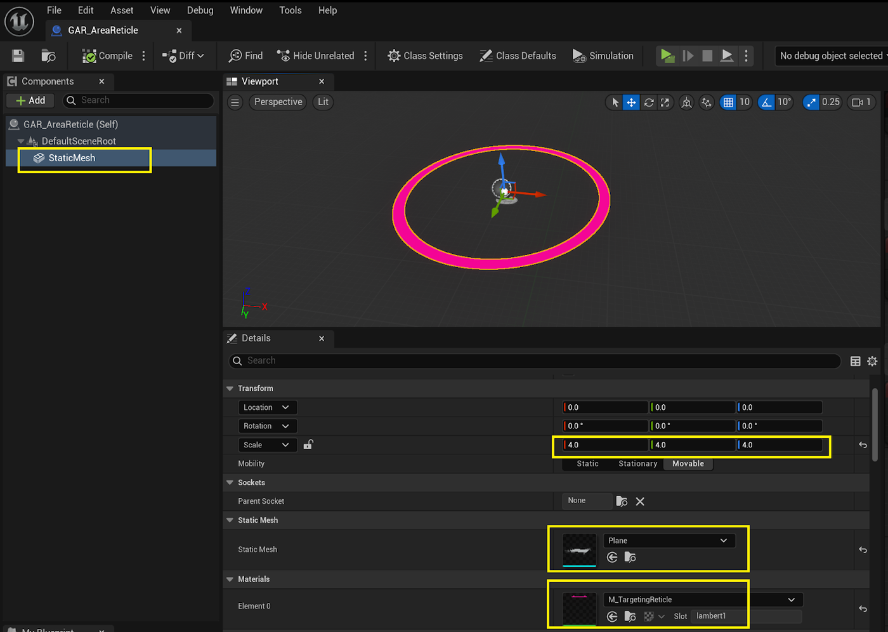

2. 材质思路：计算像素到中心的归一化距离，只在距离 0.9~1.0 之间渲染颜色（即圆环）。

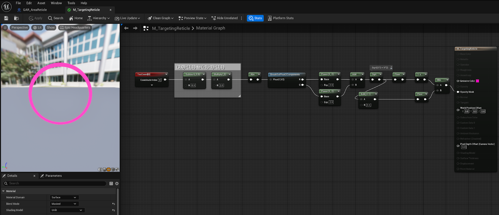

3. Plane 尺寸：引擎自带 Plane 网格在 ±50 uu，缩放到 4 倍 = 200×200 uu（正好是 200 单位半径范围）。
4. 回到 WaitTargetData 节点：关掉 Debug，把 Reticle Class 换成 `GAR_Area_200`。

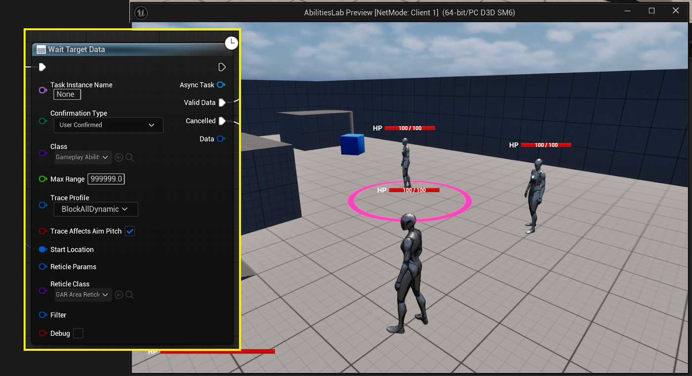

### 5.4 圆形重叠查询 + 可覆写的事件

LineTrace 只能取**一个点**，但我们想影响该点周围所有 Pawn——在点周围做**球形重叠查询**（Overlap）取所有 Pawn。有些技能能打自己、有些不能，所以给 `GA_TargetedBase` 加一个 bool 设置（是否包含自己）。由于这是父类、实际施加效果由子类做，建一个存根事件 **`ApplyToTarget`** 让子类覆写——先用 Print String 测目标选择。

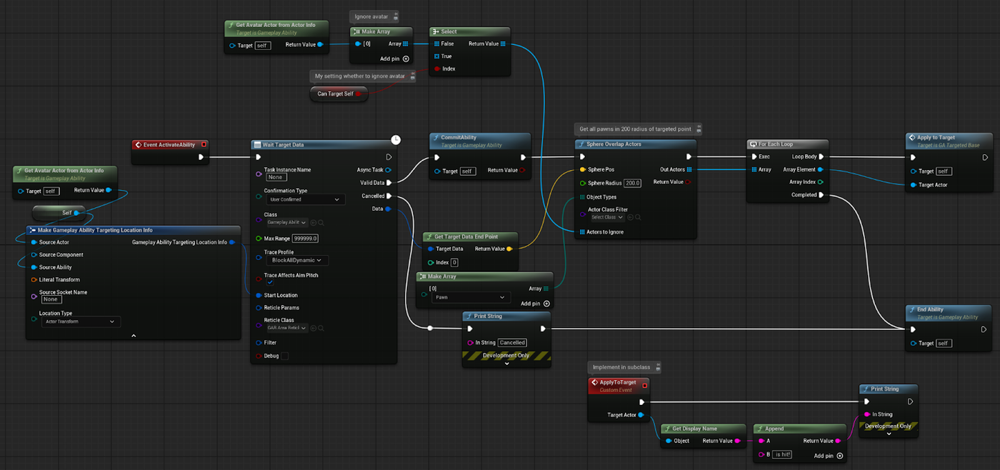

在角色蓝图里 `GiveAbility` 提供 `GA_TargetedBase`，InputID 设为 `PrimaryAbility`（可替换掉之前授 `GA_DamageSelf` 的节点）。进游戏按 Q：显示瞄准圈，圈内有目标时点击会打印目标名字。

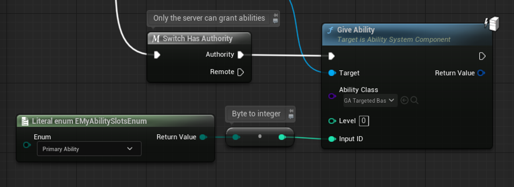

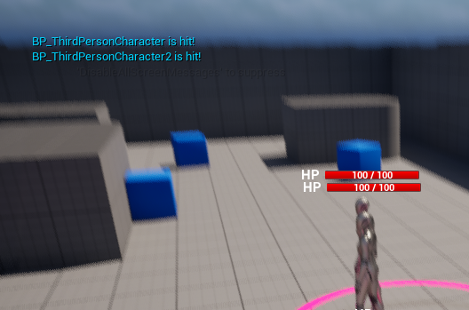

### 5.5 GA_TargetedDamage_Fixed15（真正造成伤害）

1. 从 `GA_TargetedBase` 派生子类蓝图 `GA_TargetedDamage_Fixed15`。
2. 覆写 `ApplyToTarget`：施加之前做的 `GE_Health_Minus15`。
3. **只在服务器上施加 GE**：目标选择本身需要本地预测，但**不想预测性施加 GE**——检查 `Has Authority`（是否为权威端）再施加。

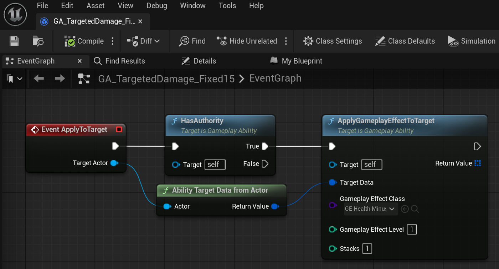

回角色蓝图把 InputID `PrimaryAbility` 换成这个技能。进游戏即可用目标技能对其他角色造成伤害。

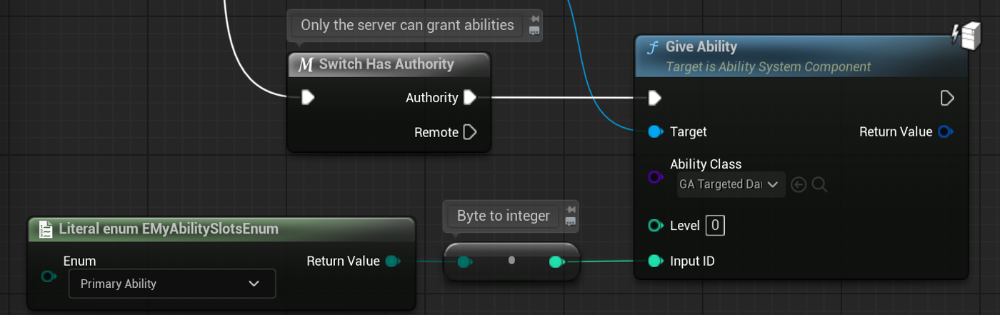

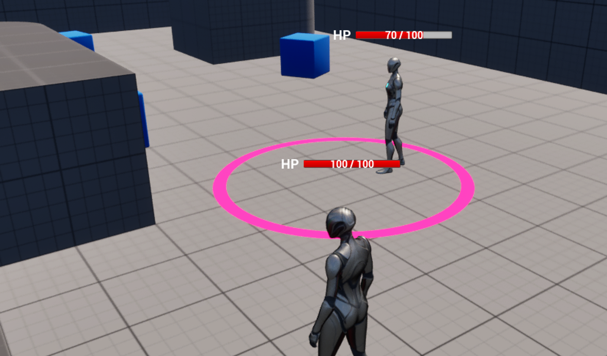

### 5.6 蓄力技能（按住越久跳越高）

用 InputID 授技能还能等待**按键抬起**。`WaitInputReleased` 能力任务可按按键时长执行逻辑。例子：按住技能键越久 `LaunchCharacter` 弹得越高。蓄力时也预测性调用 `LaunchCharacter` 让本地玩家手感即时；服务器也会调用，并把速度复制回本地客户端与其他客户端。

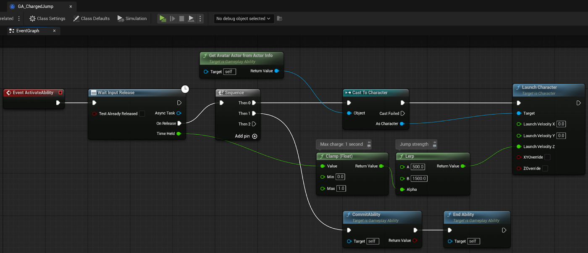

给角色授这个技能、InputID 用 `SecondaryAbility`：进游戏**按住 E 越久跳越高**。

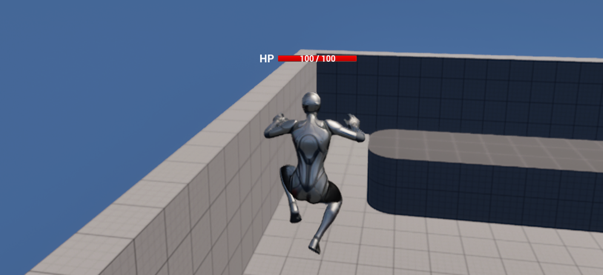

**联网为什么可能拉扯**：`CharacterMovementComponent` 的流程是“拥有者客户端先移动并记录 SavedMove → 服务器复演 → 偏差过大时纠正 → 客户端回到权威位置并重放未确认移动”。GAS 的 `PredictionKey` 主要协调技能激活以及相关 GE、Tag、Cue 等副作用；把 GA 设成 Local Predicted，**不会自动让任意 `SetActorLocation` 或速度修改进入 CharacterMovement 的 SavedMove**。

这个 `LaunchCharacter` 示例中，拥有者客户端和服务器各执行一次相同 Launch，可以让起跳看起来更及时，但高延迟、不同帧触发、碰撞差异或其它力叠加时仍可能被服务器纠正。正式项目按移动类型选择：

- 普通走、跳和已有力：尽量走 `CharacterMovementComponent` 提供的接口，并让服务器与拥有者客户端执行一致参数。
- 瞬移：服务器权威执行 Teleport，并明确按瞬移处理，避免把大位移当普通平滑移动。
- Dash、击退、拉拽、跳向目标：优先使用 **Root Motion Source**，在 GAS 蓝图里可用 `ApplyRootMotionMoveToForce`、`ApplyRootMotionConstantForce` 等 Ability Task；它们会更好地参与 CharacterMovement 的预测、复制和清理。
- 不要求即时手感的特殊位移：把技能设为 Server Only，只在服务器移动，接受一次网络往返延迟。

若继续使用 Launch，至少把蓄力时长 Clamp 到固定范围，服务器验证最终速度，并在多人 PIE 中模拟延迟/丢包观察 Network Correction。预测特效与镜头可以立即播放，最终位移和伤害仍以服务器为准。

### 5.7 反应式技能（用 Gameplay Event 触发）

技能不一定由输入触发，也能由**游戏事件**触发，或常驻监听事件。反应式技能适合实现「收到火焰伤害就做 X」、或按游戏模式/职业做出不同反应。堡垒之夜用它响应环境事件；Lyra 用它做可覆写的死亡/重生行为。

做一个**常驻监听**的「受惊吓就跳起」反应技能：

1. 新建 GameplayAbility 蓝图 `GA_SpookReaction`，设置保持默认（本地预测：本地玩家收到事件立刻播放反应）。
2. 加 **WaitGameplayEvent** 节点，等待标签为 `Abilities.Reactions.Spooked` 的事件（需先创建该标签）。
3. 事件到达后调用 `LaunchCharacter` 施加向上速度。
4. 想让技能常驻并等待事件：角色蓝图里用 **GiveAbilityAndActivateOnce** 授予并激活它。

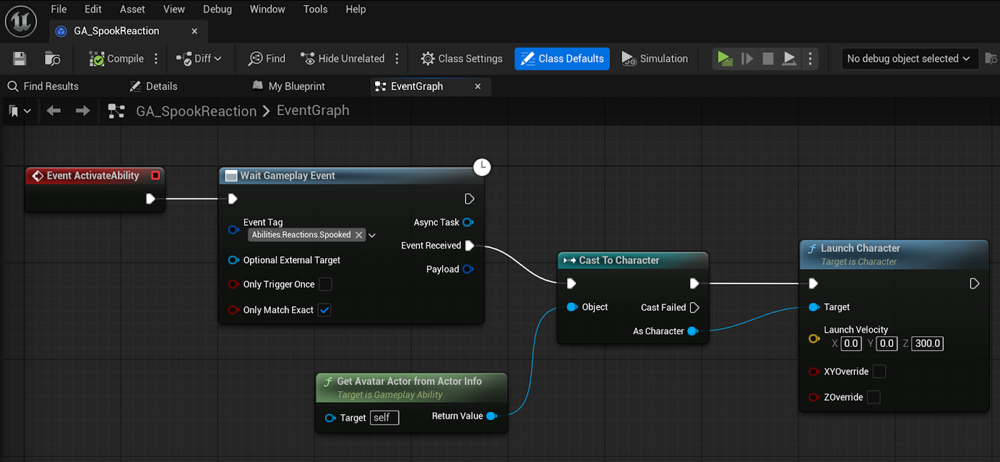

**触发端**：新建继承 `GA_TargetedBase` 的 `GA_TargetedSpook`，覆写 `ApplyToTarget` 调用 `SendGameplayEventToActor`，发送带 `Abilities.Reactions.Spooked` 标签的事件。角色蓝图里给它 InputID `UltimateAbility`（按 R 触发）。

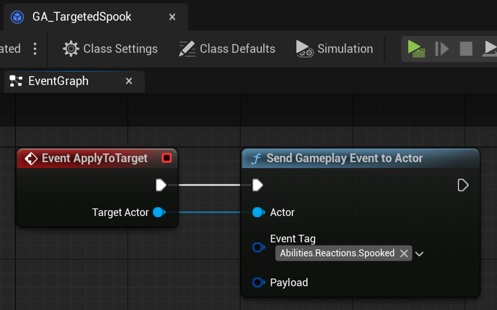

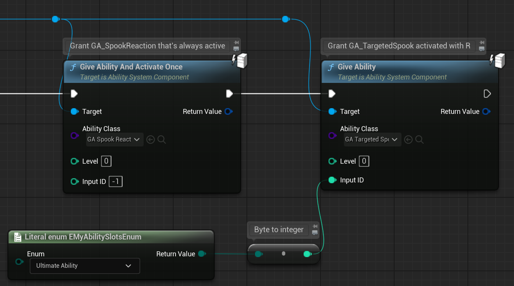

进游戏用 R 圈选目标——目标会「吓一跳」跳起来。

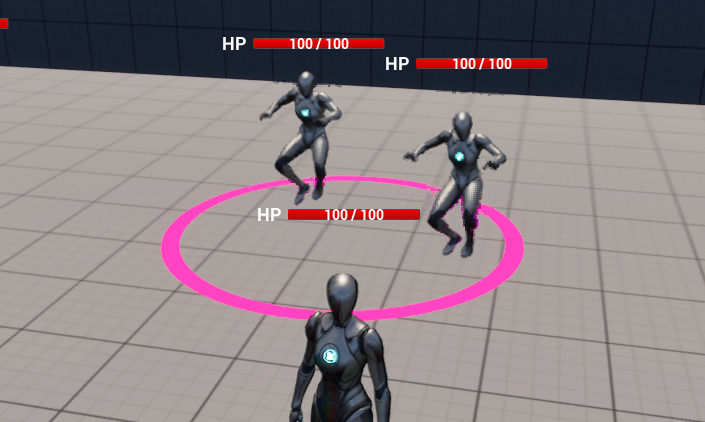

> **为什么拆成两个技能**：动作与反应解耦、用 GameplayTag 通信，可以给不同职业/模式不同反应，或让反应由装备/天赋提供——非常灵活。事件和响应也可写在同一张资产里，但拆开更模块化。

反应式能力还有另一种生命周期：在 GA 的 **Ability Triggers** 中配置 Gameplay Event Tag，只授予技能而不预先激活；事件到达时进入 `ActivateAbilityFromEvent`，从 `FGameplayEventData` 读取 Instigator、Target、EventMagnitude、OptionalObject 或 TargetData，处理后 EndAbility。它适合“每次事件触发一次、做完就结束”的反应。本教程的 `GiveAbilityAndActivateOnce + WaitGameplayEvent` 属于**常驻监听**模式；如果一次响应后还要继续监听，就不要结束能力，并确认 WaitGameplayEvent 持续触发或在回调后重新创建等待任务。

联网时，客户端发给另一个玩家的受击、死亡等事件不能直接当成权威事实：由服务器验证目标和结果后发送 Gameplay Event；客户端可先播放不影响规则的预测表现。

---

## 第 6 步 · Gameplay Cue 入门

**Gameplay Cue** 是 GAS 里在客户端播放视听反馈的系统：一个用 GameplayTag 标识、可带参数（幅值、涉及的 Actor）的广播事件。Cue 总是在某个 Actor 上执行（设计上要求该 Actor 带 ASC）。客户端通过**可蓝图化的 GameplayCueNotify (GCN) 类**响应——GCN 监听某个标签；运行时，GCN 要么在收到对应标签的 cue 时按需生成，要么用一个静态单例（类的 CDO）处理，取决于你选的 GCN 基类。

> ⚠️ **Cue 只做表现、不做逻辑**：GameplayCueNotify **不会在专用服务器（dedicated server）上执行**。服务器可以发 cue，但只有独立进程、监听服务器与客户端会执行响应的 GCN。所以千万别用 Cue 跑游戏逻辑或改游戏状态。

**该系统有几个使用注意点**：
1. 一个标签只能有一个 GCN 类监听，**先加载的那个生效**；
2. GCN 是「被发现」而非被引用的——打包时必须确保 GCN 类被打进去（例如 Project Settings > Additional Asset Directories To Cook）；
3. 编辑器对新建/删除的 GCN 蓝图类**不会立刻识别**——新建/删除后可能需要**重启编辑器**。

### 6.1 GCN_DamageNumber：打印伤害数字

做一个监听伤害事件并打印伤害数字的 GCN：
1. 新建蓝图，父类 **GameplayCueNotify_Static**（只打印字符串、不需要每次实例化，用 Static——它不实例化、只能执行函数、不能有状态），命名 `GCN_DamageNumber`。
2. 配置其 GameplayCueTag 为 `GameplayCue.DamageNumber`（先创建该标签）。
3. 覆写 **OnExecute**，打印参数里的 `RawMagnitude`。
4. 建好 GCN 后**重启编辑器**，确保被识别。

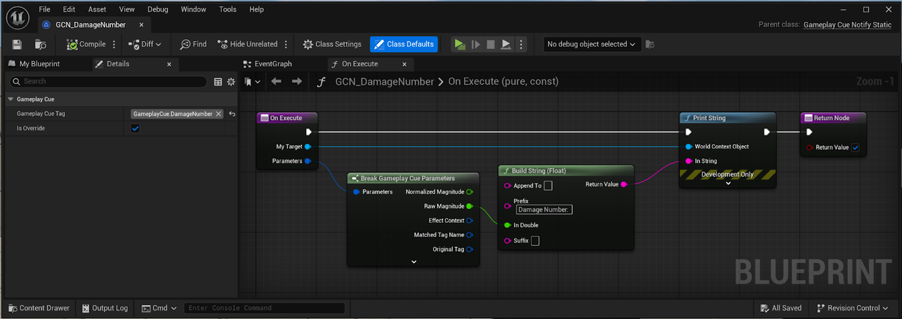

### 6.2 从 GE 触发 Cue

打开一直用的 `GE_Health_Minus15`，在 **GameplayCues** 属性加一项：Tag 配 `GameplayCue.DamageNumber`，MagnitudeAttribute 选我们的 `Damage` 属性。

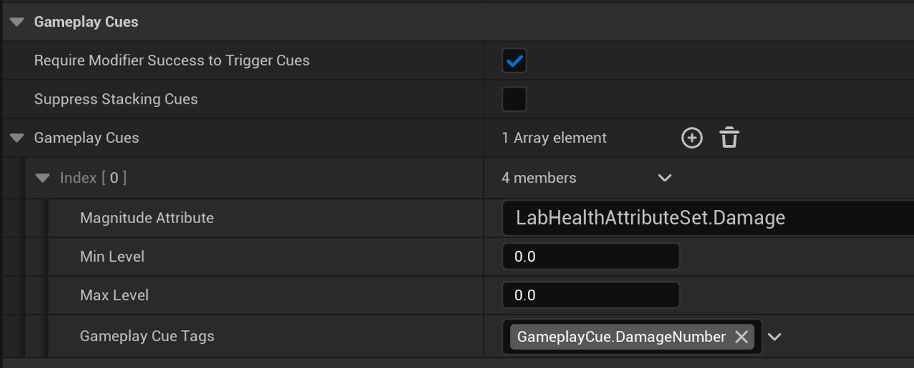

之后每次对目标施加该 GE，就会在目标身上以 `GameplayCue.DamageNumber` 为标识、15 为幅值执行一次 cue；`GCN_DamageNumber` 会在客户端监听并处理。进游戏造成伤害试试是否打印——不生效就先重启编辑器，并确认没有别的 GCN 抢听同一标签。

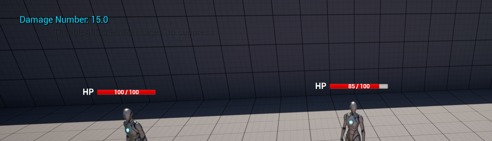

### 6.3 从属性集/代码触发 Cue

GE 的 modifier 数值常常不是你想显示的真实值。例如：
- 目标只剩 5 血，打 15 应显示 **5**；
- 有护甲减伤时，想分别显示「最终伤害」与「被挡掉的量」；
- 自定义的闪避/暴击逻辑可能想用不同标签触发、让另一个 GCN 响应。

真实数值通常出现在两处：`GameplayEffectExecutionCalculation`（自定义公式算入伤时），或 `AttributeSet` 类（最终伤害被护盾属性削减、或被剩余血量截断时）。两处都可以对受影响 ASC 调 **`ExecuteGameplayCue`**。联网时由服务器调用即可，调用与参数会复制到客户端由 GCN 响应。

例子——在我们 Health 属性集的 `PostGameplayEffectExecute` 里：之前引入了 `Damage` 元属性让属性集自己换算扣血，现在可以算出**实际施加的伤害**（考虑剩余血量：15 伤害打 5 血 → 实际 5），再执行 cue 传 5。下面函数单机/联网通用：

```cpp
void ULabHealthAttributeSet::PostGameplayEffectExecute(const FGameplayEffectModCallbackData& Data)
{
    Super::PostGameplayEffectExecute(Data);
    UE_LOG(LogTemp, Warning, TEXT("PostApply: Gameplay Effect '%s' effect"), *Data.EffectSpec.Def->GetClass()->GetName());

    if (Data.EvaluatedData.Attribute == GetDamageAttribute())
    {
        const float DamageValue = FMath::Max(0.0f, GetDamage());
        SetDamage(0.0f);

        const float OldHealthValue = GetHealth();
        const float NewHealthValue = FMath::Clamp(
            OldHealthValue - DamageValue, 0.0f, GetMaxHealth());
        const float ActualDamage = OldHealthValue - NewHealthValue;
        SetHealth(NewHealthValue);

        if (ActualDamage > 0.0f)
        {
            if (UAbilitySystemComponent* ASC =
                    GetOwningAbilitySystemComponent())
            {
                FGameplayCueParameters CueParams;
                CueParams.RawMagnitude = ActualDamage;
                CueParams.EffectContext =
                    Data.EffectSpec.GetEffectContext();

                const FGameplayTag DamageNumberTag =
                    FGameplayTag::RequestGameplayTag(
                        TEXT("GameplayCue.DamageNumber"));
                ASC->ExecuteGameplayCue(
                    DamageNumberTag, CueParams);
            }
        }
    }
}
```

Gameplay Cue 的网络通知以低成本表现为目标，不应当作可靠的玩法消息；即使某次伤害数字没有显示，权威伤害也必须已经在 AttributeSet 中完成。打包前还要确认 GCN 所在目录会被 Cook：若该目录没有被其它资产硬引用，把它加入 **Project Settings → Packaging → Additional Asset Directories to Cook**，并用打包后的 Development 构建实际验证一次。

### 6.4 滚动伤害数字

不再用 Print String，改为在世界里生成伤害数字：
1. 建 Widget 蓝图 `WBP_ScrollingText`：一个 TextBlock，暴露一个 `TextToDisplay` 字符串属性，把 TextBlock 的 Text 绑到它。

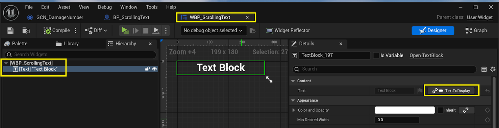

2. 建 Actor 蓝图 `BP_ScrollingText`：同血条那样加 Widget Component（Screen Space、Widget Class 选 `WBP_ScrollingText`）；再加一个 **ExposeOnSpawn** 的 Text 属性，让生成时可传入文本。`BeginPlay` 时把传入文本交给 Widget；给 Actor 一个向上的运动，并设一个有限的 **Lifespan** 让它自动销毁。

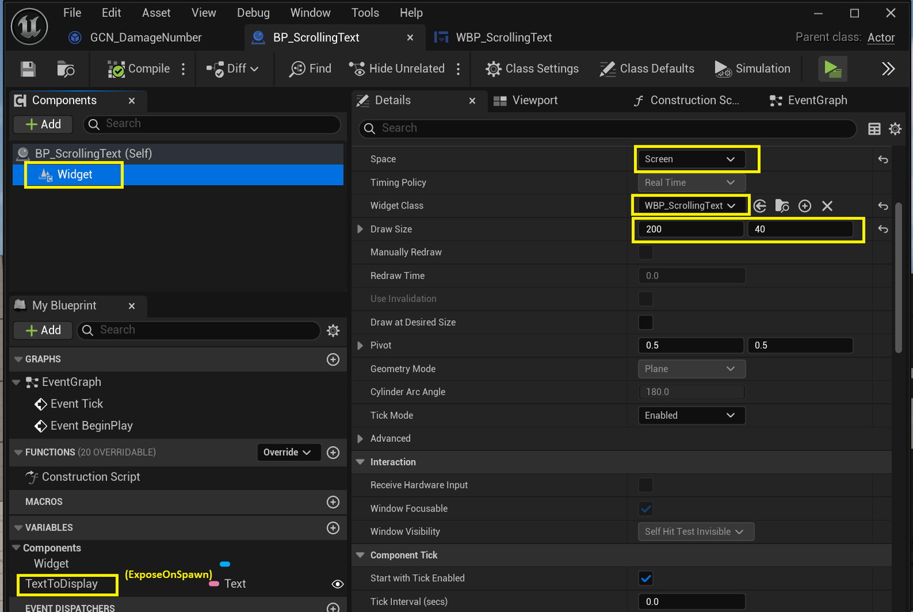

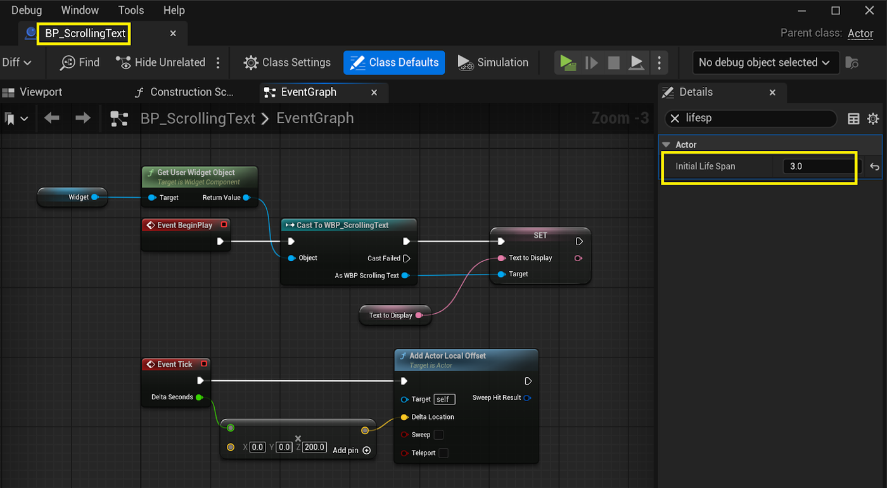

3. 更新 `GCN_DamageNumber`：不再打印，改为在受击 Actor 位置生成 `BP_ScrollingText`，把伤害数字作为文本传入。

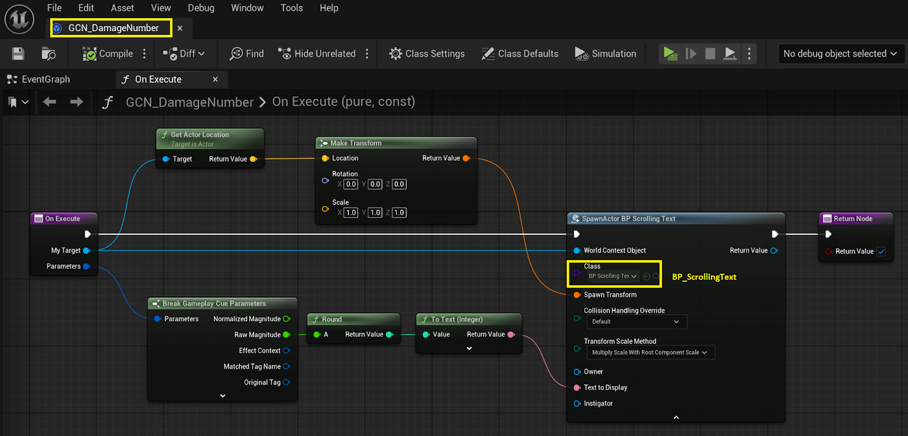

进游戏造成伤害：世界里的滚动伤害数字出现。


---

## 总结

本教程带你走了一遍 GAS 的主干：

- 用 **Gameplay Attribute** 管理生命/伤害；
- 用 **Gameplay Effect** 修改属性与标签；
- 用 **Gameplay Ability** 施加效果或直接调用游戏逻辑；做了**目标、蓄力、反应式**三种技能示例；
- 用 **Gameplay Cue** 生成伤害数字；示例覆盖了血条、瞄准圈、滚动伤害数字等表现层。

所有内容单机与联网都通用（个别地方已明确标出教学简化和产品级替代方案）。到这里，你已经具备一条完整的实践链路：初始化 ASC 与属性 → 用 GE 表达数值和状态 → 用 GA 组织输入、目标、消耗与冷却 → 用 Execution 做权威结算 → 用 Gameplay Cue 做客户端表现。无需再打开其它网页才能完成本教程。

---

## 附 A · 社区常见坑（官方论坛反馈汇总）

跟做原文时，不少人在官方论坛报过这些坑（本中文版已把修复写进正文，这里集中列出备查）：

1. **目标技能崩溃：`check(PC)` 失败（PlayerController 为空）** —— 服务器与发起客户端在 `AimWithPlayerController` 里 `GetCurrentActorInfo()->PlayerController` 可能过期/为空。修复：在角色 `PossessedBy` / `UnPossessed` 里调用 `LabAbilitySystemComp->RefreshAbilityActorInfo()`。也有人提到「先 Commit 技能」也能规避。
2. **看不到调试线** —— 线追踪其实在工作，只是角色身体挡住了从脚下发的调试线。按 F8 飞行视角绕开看即可。
3. **GCN 不生效** —— 新建/删除 GCN 蓝图类后**重启编辑器**；并确认没有另一个 GCN 抢听同一 GameplayTag。
4. **`Attribute == GetHealthAttribute()` 比较不生效（某些版本）** —— 例如 UE 5.7.2 下可改用比较 `Attribute.AttributeName == GetHealthAttribute().AttributeName`。
5. **必须把 ASC 挂出来就能用？** —— `IAbilitySystemInterface` 不是强制要求（引擎会回退到组件搜索），但**强烈建议实现**：接口查找 O(1)、组件搜索 O(n)，大项目差异明显。
6. **给技能配了冷却/消耗却没用** —— 记得在技能蓝图里调用 `CommitAbility` 并检查返回值（Commit 可能失败）。

## 附 B · 官方来源（仅供核对）

- 原文（英文，含全部截图）：<https://dev.epicgames.com/community/learning/tutorials/8Xn9/unreal-engine-epic-for-indies-your-first-60-minutes-with-gameplay-ability-system>
- 官方中文机翻页（备查）：<https://dev.epicgames.com/community/learning/tutorials/EWk4/unreal-engine-epic-for-indies-gameplay-60>
- 官方 GAS 最佳实践：<https://dev.epicgames.com/community/learning/tutorials/DPpd/unreal-engine-gameplay-ability-system-best-practices-for-setup>
- 官方 GAS 调试工具：<https://dev.epicgames.com/community/learning/tutorials/Y477/unreal-engine-gas-debugging-tools>
- 官方论坛讨论帖：<https://forums.unrealengine.com/t/tutorial-your-first-60-minutes-with-gameplay-ability-system/2439821>

*本文件为个人学习用途的非官方中文译本；术语以 Epic 官方中文文档为准时可能略有出入，请以英文原文为准。*
